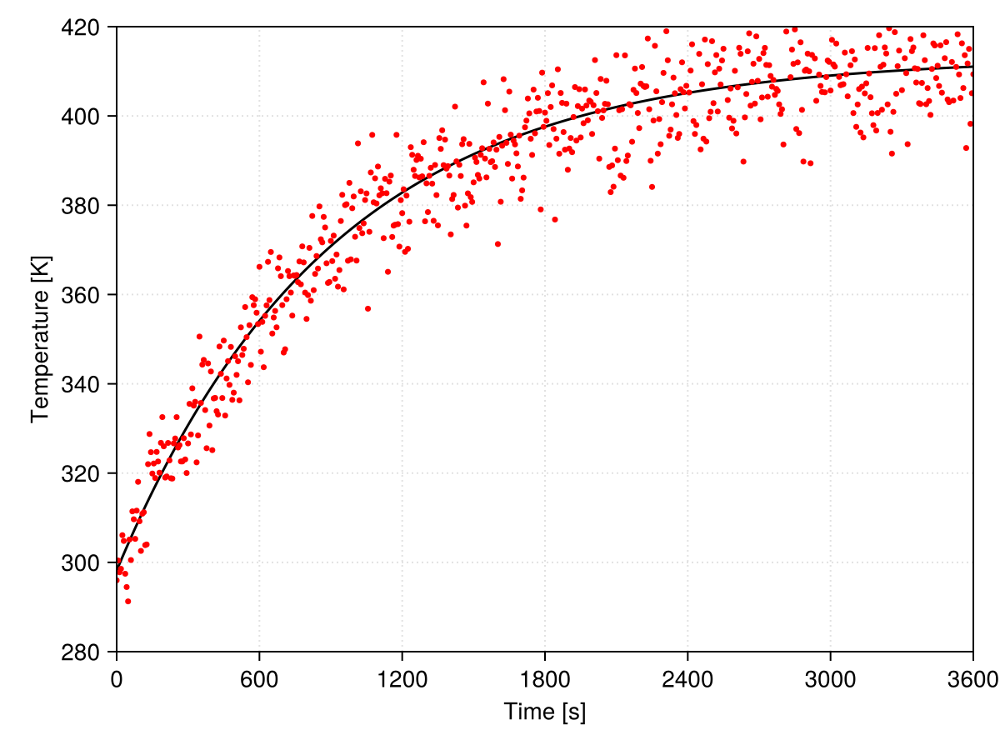
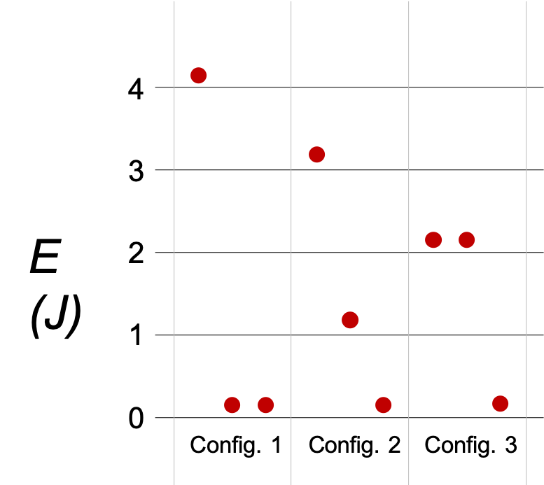

# Software

## Scientific Computing

Notes related to my learning and teaching interests in several fields related to scientific computing (mostly applied mathematics and machine learning) and related applications. This home page is the entry point and those interested in more content and interesting links navigate below between the multiple pages. It can also be used as a general guide for introducing scientific computing as it tries to introduce the minimal skill set any scientific computing engineer or scientist should have:

- Version control comes first, everything else is worthless without it, currently that means Git.
- Next comes software documentation with Doxygen, Sphinx, and/or Documenter.jl.
- A low(er) level programming language among C, C++, and Fortran, preferably all of them.
- Scripting languages, as of 2024, Python is mandatory, Julia highly recommended.
- Basic machine learning in one of the above scripts, everything is ML these days.
- Shell automation, basis of both Bash/other UNIX shell and PowerShell are required.
- Typesetting equations reports and presentations (beamer) in LaTeX.
- Domain specific skills related to the field of study (CFD, DFT, MD, ML, ...).

A sample setup of an operating system for scientific computing and practicing the above skills is provided in a section dedicated to Ubuntu.

Some technologies have been mainstream or important in the past, but nowadays some of them have already died or are becoming too niche to be put in such a list. That is the case of SVN for version control. As for programming languages in science, that is the case of *matlabish* (MATLAB, Octave, Scilab) environments, which are still used by *controls and automation* people, but are mostly incompatible with good software practices and should be discouraged.

It is also worth getting familiar with high-performance computing (HPC); in the [Top 500](https://top500.org/) page you can get to know the most powerful computers on Earth.  The [specification benchmarking](https://spec.org/) page allows for the check of hardware specification, what is interesting when preparing investment in a computing structure. Lastly, when working in multi-user systems it is worth knowing about job management systems such as [Slurm](https://www.schedmd.com/).

As a last word, I would like to remember that it is humanly impossible to master everything at once; even after more than 10 years in the field as of today I only have a grasp in the tools I do not use everyday. Software and methods evolve, and unless you keep using a specific tool you simply cannot afford to keep up to date with it. That should not be a roadblock for a scientist in the long term. As you get used to scientific software, getting back to a good level of some tool you used in the past is quick (but not extremely fast in some cases) and learning new tools for which you already know the science behind is trivial. Even exploring new fields become easy in some cases.

### Command line basics

If this is you first time using the command prompt you might be interested by this section. The command prompt (often referred to as *terminal* in Linux world) is your interface to interact with the operating system and many available tools. To learn any useful scientific computing skills it is useful to get a grasp of its use because it is there that we will launch most applications. The illustrations below assume you are working under Windows, but the introductory commands are common to most operating systems. 

Now let's launch a terminal. If you are working under VS Code you can use the shortcut to display the terminal `Ctrl+J`; the bottom of your window should display something as

```console
PS D:\Kompanion>
```

The start of this line displays you *path* in the system; depending on your configuration that could not be the case and you can ask the OS to give you that with `pwd` (print working directory)

```console
PS D:\Kompanion> pwd

Path
----
D:\Kompanion
```

If you are invited to move to directory `src` you may which to use command *change directory*, or `cd` in the system's language

```console
PS D:\Kompanion> cd .\bin\
PS D:\Kompanion\bin> 
```

Now that you reached your destination, you might be interested at inspecting the contents of this directory, *i.e.* listing its contents; that is done with `ls` as follows

```console
PS D:\Kompanion\bin> ls


    Directory: D:\Kompanion\bin


Mode                 LastWriteTime         Length Name
----                 -------------         ------ ----
d-----         1/31/2025  11:11 AM                apps
d-----          2/3/2025   9:19 AM                data
d-----         1/30/2025   2:34 PM                downloads
d-----          2/3/2025  11:50 AM                pkgs
d-----         1/31/2025   9:33 AM                scripts
d-----         1/30/2025   9:58 AM                tests
-a----         1/31/2025   9:33 AM           2697 activate.bat
-a----         1/30/2025   9:58 AM            161 code.bat
-a----         1/30/2025   9:58 AM            132 kode.bat
-a----         1/30/2025   9:58 AM            131 kpip.bat
```

Oops! It was not the directory you wanted to go to! No problems, you can navigate *one-level-upwards* using the special symbol `..` (two dots) and change directory again

```console
PS D:\Kompanion\bin> cd ..\docs\
PS D:\Kompanion\docs> 
```

This is the minimum you need to know: navigate, know your address, inspect contents.

### Scientific software

#### Geometry

- [blender](https://www.blender.org/): the most powerful 3D (in the general sense) open source modeling tool; allows geometries to be exported to STL, which is compatible with most meshing software.

- [FreeCAD](https://www.freecad.org/?lang=fr_FR): contrarily to [blender](https://www.blender.org/), this is the most mature open source modeling tool in the technical sense. It supports both 3D conception and detailed drawing, among other features.

- [cadquery](https://github.com/CadQuery/cadquery?tab=readme-ov-file): a simple parametric geometry tool.

#### Meshing

-  [gmsh](https://gmsh.info/): the *to-go* meshing tool for 2D geometries and visualization of many formats of 3D meshes; before trying to produce reliable structured meshes and geometry in 3D some ninja skills need to be developed. Its own scripting language makes parametric meshing easy.

- [MeshLab](https://github.com/cnr-isti-vclab/meshlab): allows to manipulate triangulated grids generated in CAD; helpful for preparing patches for use with #OpenFOAM/snappyHexMesh .

#### Rendering

- [ParaView](https://www.paraview.org/): the *de facto* post-processing tool for many fields of application. 
 
- [trame](https://kitware.github.io/trame/): rendering results in web-applications.

#### Simulation

- [Elmer](https://docs.csc.fi/apps/elmer/): multiphysics FEM toolkit (see dedicated topic).

- [OpenFOAM](https://openfoam.org/): general purpose FVM CFD toolkit (see dedicated topic).

- [TRUST Platform](https://cea-trust-platform.github.io/):  the basis for [TrioCFD](https://github.com/cea-trust-platform/TrioCFD-code) code by CEA.

#### Productivity

[Obsidian](https://obsidian.md/) is the *de facto* solution for note-taking and *second brain* management, but it is not free for commercial ends and that has become a problem for my intended work use. Looking for alternatives for this tool which is my main productivity setting, I came across the following packages. Testing was done with *I want it to be the same* mindset and if after a few minutes I was not convinced by the application, it was automatically discarded. In summary, I liked both *Joplin* and *Zettlr* but will pursue the use of the latter only as *Joplin* does not meet by criteria. *StandardNotes* is a false open-source package and *logseq* is still too raw for any production setting.

| Software                                                  | Pros                                                                                                                                    | Cons                                                                                                                                                                                                                                 |
| --------------------------------------------------------- | --------------------------------------------------------------------------------------------------------------------------------------- | ------------------------------------------------------------------------------------------------------------------------------------------------------------------------------------------------------------------------------------ |
| [laurent22/joplin](https://github.com/laurent22/joplin/)  | Rich interface with many features; excellent tool if you are not seeking version control as a target. Available as portable executable. | Counterintuitive interface and files are not directly stored as `.md`; file system synchronization requires and absolute path. After closing the executable, a process was kept alive.                                               |
| [logseq/logseq](https://github.com/logseq/logseq)         | Available as portable executable.                                                                                                       | Poor UI at first sight. Fast but *dumb* in the sense it will only support *one file* with a given title, what is incompatible with my way of organizing directories. Pages are not organized as in the folder view.                  |
| [standardnotes/app](https://github.com/standardnotes/app) | Interface is cleaner/less cluttered than Joplin. Available as portable executable.                                                      | Stopped using it as received the first notification that smart tags require a paid plan. Also only plain text files are supported in free mode.                                                                                      |
| [Zettlr/Zettlr](https://github.com/Zettlr/Zettlr)         | Support to YAML frontmatter. UI gets better as you open files. Integration to BibTeX.                                                   | Poor UI at first sight.  Not available as portable executable; but installation can be done in any user folder, what is also fine. It took a long time to import my existing *second brain* and sometimes it glitches/has some lags. |

#### Other

- [protobuf](https://protobuf.dev/getting-started/pythontutorial/): for parsing #OpenFOAM dictionaries from Python.

## General Tips

### Running Jupyterlab from a server

#programming/python/jupyter 

Before running the server it is a good idea to generate the user configuration file:

```bash
jupyter-lab --generate-config
```

By default it will be located at `~/.jupyter/jupyter_lab_config.py`. Now you can add your own access token that will simplify the following steps (and allow for reproducible connections in the future).

```python
c.IdentityProvider.token = '<YOUR_TOKEN>'
```

The idea is illustrated in [this](https://stackoverflow.com/questions/69244218) thread; first on the server side you need to start a headless service as provided below. Once Jupyter starts running, copy the token it will generate if you skipped the user configuration step above.

```bash
jupyter-lab --no-browser --port=8080
```

On the host side (the computer from where you wish to edit the notebooks) establish a ssh tunel exposing and mapping the port chose to serve Jupyter:

```bash
# Notice that the ports below must be specified as:
# ssh -L <local_port>:localhost:<remote_port> <REMOTE_USER>@<REMOTE_HOST>
ssh -L 8080:localhost:8080 <REMOTE_USER>@<REMOTE_HOST>
```

Now you can browse to `http://localhost:8080/` and add the token you copied earlier or your user-token you added to the configuration file. Notice that you need to keep the terminal you used to launch the port forwarding open while you work.

### Downloading from YouTube

#programming/python/tips 

Retrieving a video or playlist from YouTube can be automated with help of [yt-dlp](https://github.com/yt-dlp/yt-dlp).

To get the tool working under Ubuntu you can do the following:

```bash
# Install Python venv to create a local virtual environment:
sudo apt install python3-venv

# Create an homonymous environment:
python3 -m venv venv

# Activate the local environment:
source venv/bin/activate

# Use pip to install the tool:
pip install -U --pre "yt-dlp[default]"
```

**NOTE:** alternative applications as [youtube-dl](https://github.com/ytdl-org/youtube-dl) and [pytube](https://pytube.io/en/latest/) are now considered to be legacy as discussed in this [post](https://www.reddit.com/r/Python/comments/18wzsg8/good_pytube_alternative/).

### Installing Python packages behind proxy

#programming/python/tips 

To install a package behind a proxy requiring SSL one can enforce trusted hosts to avoid certificate hand-shake and allow installation. This is done with the following options:

```bash
pip install --trusted-host pypi.org --trusted-host files.pythonhosted.org <pkg>
```

### Extracting text from PDF

Provides reference text exported from PDF files. 

The engine uses a combination of [tesseract](https://github.com/tesseract-ocr/tesseract) and [PyPDF2](https://github.com/mstamy2/PyPDF2) to perform the data extraction. Nonetheless, human curation of extracted texts is still required if readability is a requirement. If quality of automated extractions is often poor for a specific language, you might want to search the web how to *train tesseract*, that topic is not covered here.

Besides Python you will need:

- Tesseract (and a language pack) for extracting text from PDF.
- ImageMagick for image conversion.
- Poppler utils for PDF conversion

Install dependencies on Ubuntu 22.04:

```bash
sudo apt install  \
    tesseract-ocr \
    imagemagick   \
    poppler-utils
```

In case of Rocky Linux 9:

```bash
sudo dnf install           \
    tesseract              \
    tesseract-langpack-eng \
    ImageMagick            \
    poppler-utils
```

For Windows you will need to manually download both `tesseract` and `poppler` and place them somewhere in your computer. The full paths to these libraries and/or programs is provided by the optional arguments `tesseract_cmd` and `poppler_path` of `Convert.pdf2txt`.

Create a local environment, activate it, and install required packages:

```bash
python3 -m venv venv

source venv/bin/activate
    
pip install              \
    "pdf2image==1.17.0"  \
    "pillow==11.0.0"     \
    "PyPDF2==3.0.1"      \
    "pytesseract==0.3.13"
```

Now you can use the basic module [`pdf_convert`](https://github.com/wallytutor/WallyToolbox.jl/blob/main/src/py/pdf_convert.py) provided here.

### Regular expressions

Regular expressions (or simply *regex*) processing is a must-have skill for anyone doing scientific computing. Most programs produce results or logs in plain text and do not support specific data extraction from those. There *regex* becomes your best friend. Unfortunately during the years many flavors of regex appeared, each claiming to offer advantages or to be more formal than its predecessors. Due to this, learning regex is often language-specific (most of the time you create and process regex from your favorite language) and sometimes even package-specific. Needless to say, regex may be more difficult to master than assembly programming.

#### Useful tools

- [regex101](https://regex101.com/)
- [regexr](https://regexr.com/).

#### Matching between two strings

Match [all characters between two strings](https://stackoverflow.com/questions/6109882/regex-match-all-characters-between-two-strings) with lookbehind and look ahead patterns. Notice that this will require the enclosing strings to be fixed (at least under PCRE). For processing `WallyTutor.jl` documentation I have used a [more generic approach](https://github.com/wallytutor/WallyToolbox.jl/blob/89603a88d54eed1d15b9f8142640ef942cfa12ca/docs/formatter.jl#L20) but less general than what is proposed [here](https://stackoverflow.com/questions/14182879/regex-to-match-latex-equations).

#### Match any character across multiple lines

Match [any character across multiple lines](https://stackoverflow.com/questions/159118) with `(.|\n)*`.

#### Regex in Julia

Currently joining regexes in Julia might be tricky (because of escaping characters); a solution is proposed [here](https://stackoverflow.com/questions/20478823/joining-regular-expressions-in-julia) and seems to work just fine with minimal extra coding.

### SSH key generation

#### Creating the keys

Generate the SSH key pair locally (*i.e.* on your workstation); common options are:

- `-t rsa`: key type (RSA is widely supported)  
- `-b 4096`: key length (more bits = stronger, recommended 4096) 
- `-C` : comment (usually your email)

When running the command, accept defaults for storage at `~/.ssh/id_rsa[.pub]`; optionally add a passphrase for additional security (but then you will need to enter it each time you need to connect, so that's undesirable if the only reason you are creating the SSH key is to have quick access to the server).

```bash
ssh-keygen -t rsa -b 4096 -C "yourusername@your.server.com"
ssh-keygen -t ed25519 -b 4096 -C "yourusername@your.server.com"
```

If you have password access to the server and `ssh-copy-id` run the following:

```bash
ssh-copy-id -i ~/.ssh/id_rsa.pub user@remote_host
```

Alternatively (in Windows PowerShell for instance but reformat it in a single line or replace the pipes by backticks) manually append to the `~/.ssh/authorized_keys`:

```bash
cat ~/.ssh/id_rsa.pub | \
    ssh yourusername@your.server.com \
    "mkdir -p ~/.ssh && chmod 700 ~/.ssh && cat >> ~/.ssh/authorized_keys"
```

As a last option do it by hand, but you risk breaking the format of `authorized_keys`.

#### Testing Linux server

Before anything, try connecting with you identity:

```bash
ssh -i ~/.ssh/id_rsa yourusername@your.server.com
```

If that falls-back to your password connection, connect normally to the server and make sure the rights of both SSH directory and authorized keys file are right before trying again:

```bash
chmod 700 ~/.ssh
chmod 600 ~/.ssh/authorized_keys
```

Maybe the server SSH has not been enabled for key authentication, which can be inspected without opening the actual configuration file through (requires `sudo` rights):

```bash
sudo sshd -T | grep pubkeyauthentication
```

If it is not enabled, you can edit the file (find and modify `PubkeyAuthentication yes`) as follows and restart the service:

```bash
sudo vim /etc/ssh/sshd_config
sudo systemctl restart sshd

# Additional step for SELinux only:
restorecon -Rv ~/.ssh
```

Test again; upon new failure, try the verbose mode of SSH connection on your workstation:

```bash
ssh -v yourusername@your.server.com
```

while simultaneously connected to the server (`sudo`) reading the logs:

```bash
# Debian-based:
sudo tail -f /var/log/auth.log

# Under RHEL/CentOS/Fedora:
sudo tail -f /var/log/secure
```

#### Adding the key to VS Code

- Install `Remote-SSH` extension
- Press `F1` and search for `Remote-SSH: Open SSH Configuration File`
- Add an entry like the following (modifying the host name and user):

```
Host myserver
    HostName your.server.com
    User yourusername
    IdentityFile ~/.ssh/id_rsa
```

If the above fails to fill in your right user name (sometimes Windows username will appear) you can try the following workaround to enforce user:

```bash
Host yourusername@your.server.com
    HostName your.server.com
    User yourusername
    IdentityFile ~/.ssh/id_rsa
```

## Working on Windows

### Creating a portable launcher

A simple way to create a portable launcher requiring to source extra variables is by writing a simple batch script exporting or calling another script with the definitions:

```batch
@echo off

@REM Add variables to be sourced here such as
@REM set PATH="/path/to/some/dir";%PATH%
@REM ... or call another shared script doing so.
@REM call %~dp0\env

MyCode.exe
```

Because a batch script will keep a console window open, create a VB file with the following

```vb
Set oShell = CreateObject ("Wscript.Shell") 
Dim strArgs
strArgs = "cmd /c MyCode.bat"
oShell.Run strArgs, 0, false
```

In the example we assume the program is called `MyCode.exe` and the batch script has been named in an analogous way `MyCode.bat`.

### Mount a network drive in WSL

Here we assume we will mount drive `Z:` at `/mnt/z`:

```bash
# Create the mount point (if required):
sudo mkdir /mnt/z

# Mount the network drive in WSL:
sudo mount -t drvfs Z: /mnt/z
```

Actually the same procedure can be used to access a SMB drive from within WSL temporarily with:

```bash
sudo mount -t drvfs '\\path\to\smb' /mnt/<mount-point>/
```

For automatic remount, consider adding the following to your `/etc/fstab`

```bash
//path/to/smb /mnt/<mount-point>/ drvfs auto,rw,nosuid,exec,uid=1000,gid=1000 0 0
```

### Following the writing to a file

This is equivalent to Linux `tail -f <file-path>`:

```bash
Get-Content -Path "<file-path>" -Wait
```

### Finding a process handle

This is useful when Windows won't let you move a file or folder because *it is already open somewhere*. First, download and extract [Handle](https://learn.microsoft.com/en-us/sysinternals/downloads/handle); from PowerShell run the following:

```bash
./handle.exe -u -nobanner "C:\Path\To\File.txt"
```

Notice that your file might have started another process and some research might be required.

## Working on Linux

### Gnome 3

Several recent Linux distributions use Gnome 3 as the default desktop manager. A few *innovations* introduced by this environment are not really interesting and falling back to classical modes is useful:

- [Add minimize/maximize buttons to the corner of windows](https://askubuntu.com/questions/651347)
- [Include a permanent configurable dock for applications](https://micheleg.github.io/dash-to-dock/)

### Creating an AppImage installer

An *AppImage* application is a bundle intended to be portable across many distributions. Its main inconvenient is that you manually need to give execution permissions and launch it from command line every time. 

The following snippet is aimed to automating an *AppImage* installation under Gnome 3. Simply replace the fields marked by `<something>` with the required names and run the script (requires admin rights).

```bash
#!/usr/bin/env bash
set -euo pipefail

NAME="<application-name>"
ICON="<application-icon>"

SOURCE_ICO="${ICON}.png"
SOURCE_APP="<application-image-name>.AppImage"

TARGET_DIR="/opt/${NAME}"
PIXMAPS="/usr/share/pixmaps"
APPLICATIONS="${HOME}/.local/share/applications"

sudo mkdir --parents ${TARGET_DIR}

sudo cp ${SOURCE_APP} ${TARGET_DIR}
sudo chmod u+x ${TARGET_DIR}/${SOURCE_APP}

sudo cp ${SOURCE_ICO} ${TARGET_DIR}
sudo ln -s ${TARGET_DIR}/${SOURCE_ICO} ${PIXMAPS}

echo "[Desktop Entry]
Type=Application
Name=${NAME}
Exec=${TARGET_DIR}/${SOURCE_APP}
Icon=${ICON}
Terminal=false" > ${APPLICATIONS}/${NAME}.desktop

update-desktop-database ~/.local/share/applications
echo "install ok"
```

### FTPS server configuration

```bash
sudo dnf install -y vsftpd
```

```bash
sudo vim /etc/vsftpd/vsftpd.conf
```

```ini
ssl_enable=YES
allow_anon_ssl=NO
force_local_data_ssl=YES
force_local_logins_ssl=YES
ssl_tlsv1=YES
ssl_sslv2=NO
ssl_sslv3=NO
```

```bash
sudo openssl req -x509 -nodes -days 365 -newkey rsa:2048 \
	-keyout /etc/ssl/certs/vsftpd.pem                  \
	-out /etc/ssl/certs/vsftpd.pem
```

```ini
rsa_cert_file=/etc/ssl/certs/vsftpd.pem
rsa_private_key_file=/etc/ssl/certs/vsftpd.pem
```

```ini
chroot_local_user=YES
allow_writeable_chroot=YES
```

```bash
sudo systemctl enable vsftpd
sudo systemctl restart vsftpd
sudo systemctl status vsftpd
```

```bash
sudo firewall-cmd --permanent --add-service=ftp
sudo firewall-cmd --permanent --add-port=990/tcp
sudo firewall-cmd --reload
```


## Fresh Ubuntu

This document provides the basic steps to setup a working Ubuntu system for scientific computing. It includes the general setup and customization steps. For more on #linux, please check the dedicated section.

### Getting started

First of all, become a password-less *sudoer*, run `sudo visudo` by adding the following lines to the end of the file (by replacing `walter` by your own user name):

```text
walter  ALL=(ALL:ALL) ALL
Defaults:walter !authenticate
```

Then update the system:

```bash
sudo apt update && sudo apt upgrade -y && sudo apt autoremove
```

Install a temperature monitor cause scientific computing can burn:

```bash
sudo apt install lm-sensors xfce4-sensors-plugin
```

### Mount a NTFS drive

Add permanent mount points to external (NTFS) drives; use this section with care because this evolves between different versions of the packages. Tested and validated under Xubuntu 24.04.

```bash
# Install the required packages:
sudo apt install ntfs-3g

# Identify the disk to be mounted:
sudo parted -l

# Identify the UUID of the disk:
ls -alt /dev/disk/by-uuid/

# Test if mounting works:
sudo mount -t ntfs3 /dev/<drive> /home/<mountpoint>/

# Open fstab for edition:
sudo vim /etc/fstab

# Add a single line with the following:
# /dev/disk/by-uuid/<UUID> /home/<mountpoint>/ ntfs  defaults,uid=1000,gid=1000,umask=0022 0 0

# Check fstab for errors:
sudo findmnt --verify

# Maybe
sudo systemctl daemon-reload
```

### Version control

Install `git` (and `gh` if using GitHub) and configure credentials:

```bash
sudo apt install git gh

git config --global user.email "walter.dalmazsilva@gmail.com"
git config --global user.name "Walter Dal'Maz Silva"

# (optional)
gh auth login
```

### Scientific computing

- Install a good editor such as [Zed](https://zed.dev/download) or [VS Code](https://code.visualstudio.com/download).

- Minimum set for editing, retrieving data, and containerizing:

```bash
sudo apt install btop neovim curl terminator podman
```

- Minimum set for using system's built-in Python useful:

```bash
sudo apt install python3-pip python3-venv
```

- Install Octave programming language:

```bash
sudo apt install octave
```

- Install [Julia](https://julialang.org/downloads/) programming language:

```bash
curl -fsSL https://install.julialang.org | sh
```

- Install [Rust](https://www.rust-lang.org/tools/install) programming language:

```bash
curl --proto '=https' --tlsv1.2 -sSf https://sh.rustup.rs | sh
```

- Install the whole of TeXLive and pandoc:

```bash
sudo apt install texlive-full pandoc
```

- For containers (`podman`, `apptainer`), consider checking the dedicated section.

### Personal configuration

1. Add a secondary panel on the bottom with a few launchers for office work.
2. Modify file explorer default view mode to show detailed lists.
3. Edit `~/.config/users-dirs.dirs` to remove (some) of the default home directories.

```text
XDG_DESKTOP_DIR="$HOME/"
XDG_DOWNLOAD_DIR="$HOME/Downloads"
XDG_TEMPLATES_DIR="$HOME/.Templates"
XDG_PUBLICSHARE_DIR="$HOME/"
XDG_DOCUMENTS_DIR="$HOME/"
XDG_MUSIC_DIR="$HOME/"
XDG_PICTURES_DIR="$HOME/"
XDG_VIDEOS_DIR="$HOME/"
```

4. Download `.deb` packages of Edge, Chrome, Obsidian and Zettlr.
5. Once Edge and/or Chrome is available, `sudo apt remove snapd`.
6. Productivity tools I use in graphical environments:

```bash
sudo apt install texstudio jabref
```

7. Add user applications folder to `.bashrc`:

```bash
function extra_sources() {
    source "$HOME/.cargo/env"
}

function extra_paths() {
    export PATH=$HOME/.local/bin:$PATH

    if [ -d ~/Applications ]; then
        for extrapath in ~/Applications/*; do
            export PATH="$extrapath:$PATH"
        done
    fi

    unset extrapath
}

extra_sources
extra_paths
```

8. Other `.bashrc` customization:

```bash
function build_image() {
    podman build -t $1 -f $2 .
}

function run_container() {
    podman run -it $1 /bin/bash
}

function openfoam12() {
	FOAM_NAME=$HOME/Applications/openfoam12-rockylinux9
	apptainer run --cleanenv --env-file ${FOAM}.env ${FOAM}.sif
}
```

### Limiting CPU frequency

Management of CPU frequency can be done through `cpufrequtils`; sometimes it will only work if cores are set individually (with flag `-c` to specify the zero-based core number).

```bash
# Check before:
cpufreq-info

# Modify bounds:
cpufreq-set -c <i> -u 2.5GHz
...

# Check after:
cpufreq-info
```

## LaTeX

### Math typesetting with LaTeX

- For integrals to display the same size as fractions expanded with `\dfrac`, place a `\displaystyle` in front of the `\int` command.

### Code typesetting with LaTeX

- For some reason `minted` blocks `\begin{minted}...\end{minted}` have problems to render in Beamer (something related to multilevel macros). I managed to insert code blocks with `\inputminted` as reported [here](https://tex.stackexchange.com/questions/159667/including-python-code-in-beamer).

- Beamer have some issues with footnotes, especially when use `column` environments; a quick fix for this is through `\footnotemark` and `\footnotetext[<number>]{<text>}` as described [here](https://tex.stackexchange.com/questions/86650/how-to-display-the-footnote-in-the-bottom-of-the-slide-while-using-columns). Notice that `\footnotemark` automatically generates the counter for use as `<number>` in `\footnotetext`.

- For setting a background watermark in Beamer one can use package `background` and display it using a Beamer template as described [here](https://tex.stackexchange.com/questions/244091/watermark-using-background-package-in-beamer).

### MiKTeX

- [mathkerncmssi source file could not be found](https://tex.stackexchange.com/questions/553716/mathkerncmssi-source-file-could-not-be-found)

- [Installing user packages and classes](https://docs.miktex.org/manual/localadditions.html)

### LaTeX Workshop

- [Configuring builds in VS Code with LaTeX Workshop](https://tex.stackexchange.com/questions/478865/vs-code-latex-workshop-custom-recipes-file-location) for building with `pdflatex`. Finally I ended creating my own workflows in this [file](https://github.com/wallytutor/WallyToolbox.jl/blob/main/tools/vscode/user-data/User/settings.json).

## Visual Studio Code

### Basics

If you are reading this, you are probably using [VS Code](https://code.visualstudio.com/) for the first time or need a refresher! VS Code is Microsoft's open source text editor that has become the most popular editor in the past decade. It is portable (meaning it works in Windows, Linux, and Mac) and relatively light-weight (it won't use all you RAM as some proprietary tools would do). There are a few shortcuts you might want to keep in mind for using this tool in an efficient manner:

- `Ctrl+J`: show/hide the terminal
- `Ctrl+B`: show/hide the project tree
- `Ctrl+Shift+V`: display this file in rendered mode
- `Ctrl+Shift+P`: access the command pallet
- `Ctrl+K Ctrl+T`: change color theme
- `Alt+Z`: toggle column wrapping

A few more tips concerning the terminal:

- `Ctrl+L` gives you a clean terminal (also works inside Julia prompt)
- `Ctrl+D` breaks a program execution (*i.e.* use to quit Julia prompt)

If you copied a command from a tutorial, you **CANNOT** use `Ctrl+V` to paste it into the terminal; in Windows simply right-click the command prompt and it will paste the copied contents. Linux users can `Ctrl+Shift+V` instead.

Notice that `Ctrl+M` will toggle the visibility of the integrated terminal; if you accidentally press it, autocompletion will stop working in terminal. Just press it again and normal behavior will be recovered.

### Extensions

VS Code supports a number of extensions to facilitate coding and data analysis, among other tasks. Local (user-created) extensions can be manually installed by placing their folder under `%USERPROFILE%/.vscode/extensions` or in the equivalent directory documented [here](https://code.visualstudio.com/docs/editor/extension-marketplace#_where-are-extensions-installed). Below you find my recommended extensions for different purposes and languages.

#### Julia

- [Julia](https://github.com/julia-vscode/julia-vscode)
- [Julia Color Themes](https://github.com/CameronBieganek/julia-color-themes)

#### Personal

I have also developed a few (drag-and-drop) extensions; in the future I plan to provided them through the extension manager.

- [wallytutor/elmer-sif-vscode: VS Code extension for Elmer Multiphysics SIF](https://github.com/wallytutor/elmer-sif-vscode)

## Git

### Version control in Windows

- [TortoiseGIT](https://tortoisegit.org/): for Windows users, this applications add the possibility of managing version control and other features directly from the file explorer.

### Creating gh-pages branch

To create a GitHub pages branch with no history do the following

```bash
git checkout --orphan gh-pages
git reset --hard
git commit --allow-empty -m "fresh and empty gh-pages branch"
git push origin gh-pages
```

### Adding submodules

Generally speaking adding a submodule to a repository should be a simple matter of

```bash
git submodule add https://<path>/<to>/<repository>
```

Nonetheless this might fail, especially for large sized repositories; I faced [this issue](https://stackoverflow.com/questions/66366582) which I tried to fix by increasing buffer size as reported in the link. This solved the issue but led me to [another problem](https://stackoverflow.com/questions/59282476) which could be solved by degrading HTTP protocol.

The reverse operation cannot be fully automated as discussed [here](https://stackoverflow.com/questions/1260748). In general you start with

```bash
git rm <path-to-submodule>
```

and then manually remove the history with

```bash
rm -rf .git/modules/<path-to-submodule>

git config remove-section submodule.<path-to-submodule>
```

### Line ending normalization

Instructions provided in [this thread](https://stackoverflow.com/questions/2517190); do not forget to add a `.gitattributes` file to the project with `* text=auto` for checking-in files as normalized. Then run the following:

```bash
git add --update --renormalize
```

## Containers

### Using Podman

In the open source community [podman](https://podman.io/) takes the place of [docker](https://www.docker.com/) for the creation of application containers. It mimics the commercial software to allow developers work with both tools *almost* interchangeably. It is not uncommon to find people creating aliases of `docker` in their sandbox environments to point to their `podman` executable (some Linux distributions even have packages dedicated to this automatic override). One must be aware that although the command interfaces are very similar, they are not the *exactly* same and advance usage requires mastering each of them individually.

The following summarizes some daily life commands with `podman`.

- List available images in a local machine:

```bash
podman images
```

- Run image `` interactively using bash:

```bash
podman run -it  /bin/bash
```

- Run image exposing port `<container>` to host at `<host>`:

```bash
podman run -p <container>:<host> 
```

- Dump image `` to `.tar` for portability:

```bash
podman save -o .tar 
```

- List all available containers (there might be external/hidden, so use `-a`):

```bash
podman container ls -a
```

- Remove a given container by ID (only the first 2-3 characters of ID are required):

```bash
podman container rm <ID>
```

- Remove a given image by ID:

```bash
podman rmi <ID>
# podman image rm <ID>
```

### Using Apptainer

Using `podman` locally is great, but packaging redistributable containers for reuse in HPC is much smoother with [Apptainer](https://apptainer.org/). The tool started at [Lawrence Berkeley National Laboratory](https://www.lbl.gov/) can be [downloaded](https://github.com/apptainer/apptainer/releases) for several Linux systems and deployed locally.

Under Debian (or its variants, as Ubuntu), navigate to the download directory and install with the following, taking care to replace the right version:

```shell
export APPTAINER_VERSION=1.3.6_amd64.deb

sudo dpkg -i apptainer_${APPTAINER_VERSION}
# sudo dpkg -i apptainer-dbgsym_${APPTAINER_VERSION}
# sudo dpkg -i apptainer-suid_${APPTAINER_VERSION}
# sudo dpkg -i apptainer-suid-dbgsym_${APPTAINER_VERSION}
```

- Converting a local `podman` *tar-dump* into a Singularity image:

```bash
apptainer build ".sif" "docker-archive://.tar"
```

- Running an `apptainer` image as a non-root user is as simple as:

```bash
apptainer run .sif
```

Although Apptainer has its own image scripting system through [*definition files*](https://apptainer.org/docs/user/latest/definition_files.html), personal experience has shown that the workflow is much smoother by generating container files and then converting them to Singularity format as explained above.

There reason is that container files generate intermediate check-points from which they will continue the build if some failure is encountered, *i.e.* each `RUN` command in a container will generate a partial image.

When working with Apptainer definition files, failures imply full rebuild of the image, what might become extremely boring when trying to compile new code. A workaround is to use a sequence of definition files, one importing from the dump of the previous one, but that not only will generate a large size of temporary dumps as it will become difficult to manage.

After getting excited by the Apptainer definition files because they do not need chaining of commands with a `&& \` to make a shell block, I personally gave up on them after loosing a few days of my life recompiling again and again... so for now I stick with the container creation and conversion workflow discussed in more detail below.

### Apptainer and environment

Since `apptainer` makes use of *user space*, sourcing of applications is not done as root, so one must edit add to their `~/.bashrc` if path configuration is desired and re-source that file when activating a container. For instance, the required environment variables for #OpenFOAM are provided `FOAM_SOURCE` file given below; in the *host system* outside the container it does not exist, so adding a test in `~/.bashrc` is required. Once you activate the container with `apptainer run <image-name>.sif`, by calling `source ~/.bashrc` the environment will be properly set.

```bash
FOAM_SOURCE=/opt/openfoam12/OpenFOAM-12/etc/bashrc

[[ -f ${FOAM_SOURCE} ]] && source ${FOAM_SOURCE}
```

Another approach is to execute the SIF image once, source the required variables required in the container, dump `env > draft.env`, [edit the file](https://github.com/wallytutor/learning-by-teaching/blob/main/containers/clean-env.py) as required and then wrap a call with contextualized environment as:

```bash
function openfoam12() {
    FOAM_NAME=$HOME/Applications/openfoam12-rockylinux9
    apptainer run --cleanenv --env-file ${FOAM}.env ${FOAM}.sif
}
```

### Build workflow

Using both tools can be roughly automated by generating a `podman` image, dumping it into a portable format, then converting to Singularity format. Below we illustrate the workflow for [this OpenFOAM Containerfile](https://github.com/wallytutor/learning-by-teaching/blob/main/software/containers/Containerfile-rockylinux9-openfoam12):

```bash
# Variable with name of container:
R9OF12=rockylinux9-openfoam12

# Avoid the following warning:  WARN[0000] "/" is not a shared mount, this
# could cause issues or missing mounts with rootless containers.
sudo mount --make-rshared /

# Build the container image:
/usr/bin/podman build -t "${R9OF12}" -f "Containerfile-${R9OF12}" .

# Save container to portable .tar:
/usr/bin/podman save -o "${R9OF12}.tar" "localhost/${R9OF12}"

# Convert container to
/usr/bin/apptainer build "${R9OF12}.sif" "docker-archive://${R9OF12}.tar"

# After making sure it is working, remove the image:
/usr/bin/podman rmi "${R9OF12}"
```

Now you can move the SIF image to another computer (for instance, you prepared this in a PC with access to the Internet to later use it in an isolated HPC), open a new terminal or `source ~/.bashrc` and run:

```bash
apptainer run -B $PWD /<path>/<to>/openfoam12-rockylinux9.sif
```

**Note:** use `apptainer run` when you want to execute the container's default application or task; on the other hand, use `apptainer shell` when you need an interactive session to explore or debug the container. For the OpenFOAM example above, both are very similar as no default application is launched, but a shell session itself.

## Elmer Multiphysics

Elmer is a multiphysics finite element method (FEM) solver mainly developed by CSC and maintained at [GitHub](https://github.com/ElmerCSC/elmerfem). Several resources can be found in is [official webpage](https://www.research.csc.fi/web/elmer) and in the [community portal](https://www.elmerfem.org/blog/) and in the [forum](https://www.elmerfem.org/forum/index.php). There is also an [YouTube channel](https://www.youtube.com/@elmerfem) with several tutorials and illustration of the package capabilities.

The goal of this page is not to supersede the [documentation](https://www.research.csc.fi/web/elmer/documentation), but to make it (partially) available as a webpage where search and navigation become more intuitive. *Notice that this will be fed according to my personal projects and learning, so any contribution to accelerate the process is welcome.* Here you find a *user-guide-style* page with more details are provided below in the selected notes of Elmer documentation.

### Quick answers

- [Is Elmer the adequate tool for my projects?](https://www.nic.funet.fi/pub/sci/physics/elmer/doc/ElmerOverview.pdf) In this document you find a short introduction to what Elmer can do and the main executables. 

- [How do I start learning Elmer?](https://www.nic.funet.fi/pub/sci/physics/elmer/doc/GetStartedElmer.pdf) Simply put, Elmer does not require basic users to master all the fundamentals of FEM, so following the *getting started* guide seems a good starting point. There you learn how to install, configure, and run the software.

- [Where do I get the binaries of Elmer?](https://www.nic.funet.fi/pub/sci/physics/elmer/) If willing to run in Windows, the previous link provides the compiled binaries; there are also instructions for installing directly in Ubuntu as well as all the documentation and other test and sample cases.

- [I feel alone, where do I find other users?](https://www.elmerfem.org/forum/) The forum seems to be moderately active, so you can go there to chat with other users and developers if you are not in a hurry.

### Limitations and issues

- Currently the GUI is not able to import SIF files generated manually because it stores its state in a XML file; to be able to re-run cases from the GUI users need to create the equivalent case (eventually using the free text fields) in the GUI itself before regenerating a SIF file. Notice that this will overwrite the SIF file, so keep in mind to backup the file in another directory; that is especially required for highly customized cases.

- When exporting meshes from `gmsh`, consider using the extension `.msh` and not `.msh2` as is often seen as a reminder of format 2 mesh; Elmer GUI is unable to render the mesh in this case. Notice that this has apparently no effect if running from command line.

### Ongoing work

- Development of a [VS Code syntax highlight extension](https://github.com/wallytutor/elmer-sif-vscode) with help of data provided in [SOLVER.KEYWORDS](https://github.com/ElmerCSC/elmerfem/blob/devel/fem/src/SOLVER.KEYWORDS).

### Retrieving materials

Because there are plenty of interesting materials in Elmer public directory, it is worth downloading it all and selecting what to keep later. In a Linux terminal one could run the following command. If you also want to retrieve the animations, binaries, and virtual machines, consider removing and/or modifying the `-X` options.

```bash
#!/usr/bin/env bash

URL="https://www.nic.funet.fi/pub/sci/physics/elmer/"

wget -r -l 20 --no-parent           \
    -X /pub/sci/physics/elmer/anim/ \
    -X /pub/sci/physics/elmer/bin/  \
    -R "index.html*"                \
    ${URL}
```

### Elmer Fundamentals

#### Preprocessing steps

- Other than the native `ElmerGrid`, several other software can be used for conceiving a geometry and mesh generation workflow. Users are encouraged to use external tools such as [gmsh](https://gmsh.info/) or [Salome](https://www.salome-platform.org/) to generate computational meshes, built-in support in Elmer bein limited to very simple geometries only. For complex geometries [FreeCAD](https://www.freecad.org/) is a standout alternative. For more consider reading *Geometry and Preprocessing*.

- Not all `gmsh` standard mesh formats are supported, but only version 2 (as for OpenFOAM); that said, users are encouraged to export mesh in UNV format to avoid compatibility issues, and also because both proposed tools support it. You can control the element orders in command line using option `-order <N>`; gmsh operates this way so that the same script can generate any supported element type.

- For importing meshes one uses `ElmerGrid <input-format> <output-format>`, where the format arguments are documented in the [manual](https://www.nic.funet.fi/pub/sci/physics/elmer/doc/ElmerGridManual.pdf) sections 1.3 and 1.4. The UNV input is given by number 8 while standard `ElmerSolver` output by number 2, so that the conversion command would start with `ElmerGrid 8 2 <other-arguments...>`. Always verify the number of nodes remain untouched after conversion - or if it changed when using option `-merge <dist>`, merging nodes that are closer than the user-defined `<dist>`.

- Remember to use `Coherence;`  with OpenCASCADE factory in gmsh scripts to automatically strip internal faces; that might not be enough for complex cases, see below. **Note:** I tried doing so and unless `Physical Surfaces` naming the external boundaries are provided every interface is dumped and imported by Elmer; maybe I misunderstood the use of command!

- Because faces are not named in Elmer, *i.e.* no matter what `Physical Surface` names you provide in gmsh, even for the advanced user working from command line it might be interesting to use the interactive zone grouping capabilities of `ElmerGUI`. That might even become a *requirement* as geometric complexity grows.

| Software                        | Notes                                                                                                                 |
| ------------------------------- | --------------------------------------------------------------------------------------------------------------------- |
| FreeCAD                         | Geometry only for now, probably the best in the list; good parametric modeling support. Has native Elmer integration. |
| Salome                          | Can export UNV (8) meshes readable by Elmer. An extension to call Elmer directly from Salome is under development.    |
| gmsh                            | Can export MSH2 (14) and UNV (8) formats readable by Elmer.                                                           |
| netgen                          | Is able to write native Elmer linear meshes; can be used as a plug-in.                                                |
| tetgen                          | Can be used as a plug-in.                                                                                             |

#### Using Elmer

- Newcomers might be interested in `ElmerGUI`; although very intuitive, the interface is quite limited and for complex programs running from command line is the preferred mode.

- Most users will finally end setting up an workflow employing both to `ElmerSolver` (to run the simulations) and `ElmerGrid` (to prepare the grid and setup parallelization).

- There is also `ViewFactors` which might be useful in special cases involving radiation and other executables but they are not mentioned here because they fall in the legacy code family.

- Users must be aware that Elmer has no default unit system; one must take care that units are coherent across the different models and materials.

- Support to mathematical operations in SIF through MATC, which has its own [syntax and documentation](https://www.nic.funet.fi/pub/sci/physics/elmer/doc/MATCManual.pdf). It can be used, *e.g.* for computing temperature dependent properties, what can be helpful for simple expressions (instead of writing Fortran 90 code for extensions).

#### Parallel computing

- Before running in parallel a working case running in serial is required; using `ElmerGUI` this can be enabled in `Run > Parallel settings...`. Notice that after running postprocessing of `.pvtu` needs to be done in ParaView directly.

- To partition the mesh from command line one needs to run `ElmerGrid 2 2 <mesh-name> -partdual -metiskway <N>`, which will convert `<mesh-name>` from Elmer mesh format (2) into itself (thus the `2 2` in the command) and dump the resulting mesh in `partitions.<N>`, with `<N>` being the number of physical cores to run the simulation.

- Parallel cases can be run with `mpiexec -n <N> ElmerSolver_mpi`. Notice that under Linux the MPI runner is called `mpirun` instead of `mpiexec`.

#### Tips and ideas

- Use `Coordinate Mapping` to rotate meshes with oriented particles
- Scaling of a single direction can be done with `Coordinate Scaling`
- Time step can be changed with a list of elements in `Timestep Intervals`, *e.g.*

```Fortran
! Run 10 time-steps of 0.1 s, then 100 with 1.0 s.
Timestep Intervals(2) = 10 100
Timestep Sizes(2) = 0.1 1.0
```

- Take care with `Linear System Abort Not Converged = True` for physical consistency; generally continuing a simulation after a failed step is worthless unless one is pseudo-stepping towards a difficult (highly nonlinear) steady-state.

#### Material properties

Material properties can be specified as:

- Constant: just the default numeric input in SIF files

- Tabulated linearly or using a cubic spline, *e.g.*

```Fortran
! Linear interpolation
Viscosity = Variable Temperature
  Real
	298.15 1.0
	! ... more data here
	373.15 2.0
End

! Cubic spline interpolation
Viscosity = Variable Temperature
  Real cubic
	298.15 1.0
	315.15 1.1
	345.15 1.5
	! ... more data here
	373.15 2.0
End
```

- Arrays: for representing anisotropic bodies, *e.g.*

```Fortran
Heat Conductivity(3,3) = 1 0 0\
                         0 1 0\
                         0 0 2
```

- Using MATC as explained below in this page. Notice that sourcing files in MATC is the recommended way to get reusable code; coding MATC in SIF files requires to escape all lines and quickly becomes messy.

- User-defined functions (UDF) can also be provided in Fortran; notice that even when MATC can be used, this may lead to a speed-up of calculations with the inconvenient of needing more code. So for cases that are intended to be reused, it is important to consider writing proper extensions in Fortran. The following example illustrates a temperature dependent thermal conductivity function which is evaluated by Elmer at all nodes. In most cases a simple `USE DefUtils` is enough to get the required Elmer API to write the extension.

```Fortran
FUNCTION conductivity(model, n, time) RESULT(k)
    !**************************************************************
    ! Load Elmer library.
    !**************************************************************
    
    USE DefUtils
    IMPLICIT None

    !**************************************************************
    ! Function interface.
    !**************************************************************
    
    TYPE(Model_t) :: model
    INTEGER       :: n
    REAL(KIND=dp) :: time, k

    !**************************************************************
    ! Function internals.
    !**************************************************************
    
    TYPE(Variable_t), POINTER :: varptr
    REAL(KIND=dp) :: T
    INTEGER :: idx

    !**************************************************************
    ! Actual implementation
    !**************************************************************

    ! Retrieve pointer to the temperature variable.
    varptr => VariableGet(model%Variables, 'Temperature')

    ! Access index of current node.
    idx = varptr%Perm(n)

    ! Retrieve nodal temperature.
    T = varptr%Values(idx)

    ! Compute heat conductivity from NodalTemperature, k=k(T)
    k = 2.0 - T * (2.5e-03 - 1.0e-06 * T)
END FUNCTION conductivity
```

In order to compile the above assume it is written to `properties.f90` file; then one can call `elmerf90 properties.f90 –o properties` to generate the required shared library that is loaded in runtime by Elmer. Below we illustrate the use of `Procedure` to attach this library to a given material; first one provides the name of the shared library then the name of the function. A single library can in fact contain several functionalities.

```C
Material 1
  Name = "Solid"
  Heat Conductivity = Variable Time
    Procedure "properties" "conductivity"
  Heat Capacity = 1000
  Density = 2500
End
```

#### Postprocessing

For postprocessing the recommended way is by using external tools as [ParaView](https://www.paraview.org/) and [PyVista](https://docs.pyvista.org/version/stable/), both handling well the VTK format of outputs. Nonetheless there are a some in-solver processing utilities that are worth knowing, especially in what concerns extracting and filtering data from certain regions, creating new fields, and computing fluxes.

- Creating a new scalar

The keyword set of materials is actually not fixed; one can, for instance, create composition field in different units with MATC, as illustrated below (case [here](https://github.com/wallytutor/WallyToolbox.jl/tree/main/apps/Elmer/diffusion_solids/carburizing_slycke_gui)):

```Fortran
MoleFraction = Variable Concentration
  Real MATC "carbonmolefraction(tx)"
```

Then in solver `SaveMaterials`, this new name `MoleFraction` can be used as a variable:

```Fortran
Solver 1
  Equation = SaveMaterials
  Parameter 1 = Concentration Diffusivity
  Parameter 2 = MoleFraction
  Procedure = "SaveData" "SaveMaterials"
  Exec Solver = After Timestep
End
```

Another situation that can be frequently found is unit conversion for temperature. It was chosen to implement it in [this case](https://github.com/wallytutor/WallyToolbox.jl/tree/main/apps/Elmer/conduction_refractory/transient_parallel) because it is multi-material; that is a reminder that in such cases the new variable needs to be created for all materials (as this is a tweak, since the temperature is not a material property, but a global field). If forgotten in one material, an error will show up in ParaView telling you that the field is not available in some regions.

### Solver Input Files (SIF)

Once you get serious with Elmer it is a natural evolution to prefer to work with *SIF* files instead of the GUI most of the time; the GUI remains useful for raw case generation, avoiding writing boilerplate setups and to get default values right. This is also true in a majority of scientific computing software. The documentation of *SIF* is spread over the whole documentation of Elmer and this page tries to summarize it. For the beginner, this [video](https://www.youtube.com/watch?v=iXVEqKTq5TE) is a good starting point, this page being more of a reference manual.

Because syntax highlighting is important for productivity, I am continuously developing a minimalistic extension for VS Code. Its partial development can be found [here](https://github.com/wallytutor/WallyToolbox.jl/tree/main/helpers/syntax-highlighters/sif). You can clone that repository and copy the `sif/` directory under `%USERPROFILE%/.vscode/extensions`  or in the equivalent directory documented [here](https://code.visualstudio.com/docs/editor/extension-marketplace#_where-are-extensions-installed); later it will probably be packaged as a standard VS Code extension.

#### Sections

- `Header`

- `Simulation`

- `Constants`

- `Material <n>`

- `Body <n>`

- `Solver <n>`

- `Equation <n>`

- `Initial Condition <n>`

- `Boundary Condition <n>`

### MATC

Elmer provides a few extension methods. For complex models you might be prompted to use directly Fortran 90. For simpler things, such as providing temperature dependent thermophysical properties, it has its own parser for use in SIF, the metalanguage MATC. Expressions provided in MATC can be evaluated when file is read or during simulation execution.

Because it is quite concise, I summarized the whole of MATC syntax and functions in this page. For the official documentation please refer to [this document](https://www.nic.funet.fi/pub/sci/physics/elmer/doc/MATCManual.pdf).

#### Declaring variables

Variables in MATC can be matrices and strings; nonetheless, both are stored as double precision arrays so creating large arrays of strings can represent a waste of memory. For some weird reason I could not yet figure out, MATC language can be quite counterintuitive.

Let's start by creating a variable, say `x` below; attribution, such a in Python, creates the variable. It was stated that everything is a matrix or string; since `x` is not a string, it is actually a $1\times{}1$ matrix and in this case we can omit the indexing when allocating its memory.

```C
x = 1
```

So far nothing weird; when declaring a string as `k` below we are actually creating a $1\times{}5$ row matrix, what is not unusual in many programming languages (except for being double precision here). Furthermore, we use the typical double-quotes notation for strings.

```C
k = "hello"
```

Matrix indexing is zero-based, as in C or Python. Matrix slicing is done as in many scripting languages, such as Python, Julia, Octave, ..., and we can reverse the order of the first *six* elements of an array `y` as follows: 

```C
y(0, 0:5) = y(0, 5:0)
```

Notice above the fact that matrix slicing is *last-inclusive*, as in Julia, meaning that all elements from index zero to five *inclusive* are included in the slice. Weirdness starts when you do something like

```C
z(0:9) = 142857
```

which according to the documentation will produce an array `1 4 2 8 5 7 1 4 2 8`; I could not verify this behavior yet. Additionally, the following produces another unexpected result:

```C
z(9, 9) = 1
```

If matrix `z` does not exist, this results in a $10\times{}10$ matrix with all zeros except the explicitly declared element. The size of variables are dynamic, so in the above if `z` already existed but wa smaller, it would be padded with zeros instead.

Finally, logical indexing is also allowed:

```C
x(x < 0.05) = 0.05
```

#### Control structures

MATC provides conditionals and loops as control structures. Below we have the `if-else` statement, which can be declared inline of using a C-style declaration using braces.

```C
if ( expr ) expr; else expr;

if ( expr )
{
    expr;
    ...
    expr;
} else {
    expr;
    ...
    expr;
}
```

Loops can be declared using both `for` or `while`. There is no mechanism of generating values within a `for` loop and one must provide a vector of indexes for repetition. *In the official documentation there is no reference to a `continue` or `break` statement and I could not verify their existence yet*.

```C
for( i=vector ) expr;

for( i=vector )
{
    expr;
    ...
    expr;
}

while( expr ) expr;

while( expr )
{
    expr;
    ...
    expr;
}
```

#### Operators

Assume the following definitions:

- `a`, `b` and `c` ordinary matrices  
- `l`, `t` and `r` logical matrices 
- `s`, `n` and `m` scalars 

|                                      |                                                                                                                                                                               |
| ------------------------------------ | :---------------------------------------------------------------------------------------------------------------------------------------------------------------------------- |
| `b = a'`                             | is transpose of matrix a.                                                                                                                                                     |
| `b = @a`                             | evaluate content of a string variable a as a MATC statement.                                                                                                                  |
| `t = ~l`                             | elementwise logical not of  if x is not zero.                                                                                                                                 |
| `b = a ^ s`                          | if a is a square matrix and s is integral, a matrix power is computed, otherwise an elementwise power.                                                                        |
| `c = a * b`                          | if a and b are compatible for matrix product, that is computed, otherwise if they are of the same size or at least one of them is scalar, an elementwise product is computed. |
| `c = a # b`                          | elementwise multiplication of a and b.                                                                                                                                        |
| `c = a / b`                          | is fraction of a and b computed elementwise.                                                                                                                                  |
| `c = a + b`                          | is sum of matrices a and b computed elementwise.                                                                                                                              |
| `c = a - b`                          | is difference of matrices a and b computed elementwise.                                                                                                                       |
| `l = a == b`                         | equality of matrices a and b elementwise.                                                                                                                                     |
| `l = a <> b`                         | inequality of matrices a and b elementwise.                                                                                                                                   |
| `l = a < b`                          | true if a is less than b computed elementwise.                                                                                                                                |
| `l = a > b`                          | true if a is greater than b computed elementwise.                                                                                                                             |
| `l = a <= b`                         | true if a is less than or equal to b computed elementwise.                                                                                                                    |
| `l = a >= b`                         | true if a is greater than or equal to b computed elementwise.                                                                                                                 |
| `a = n : m`                          | return a vector of values starting from n and ending to m by increment of (plus-minus) one.                                                                                   |
| `r = l & t`                          | elementwise logical and of a and b.                                                                                                                                           |
| `l = a \| b`                         | elementwise logical or of a and b.                                                                                                                                            |
| `c = a ? b`                          | reduction: set values of a where b is zero to zero.                                                                                                                           |
| `b = n m % a`                        | resize a to matrix of size n by m.                                                                                                                                            |
| `b = a`                              | assigning a to b.                                                                                                                                                             |

#### Function definitions

The syntax of the function definition is similar to that of Julia and is given below. The function body is enclosed by braces. Instead of using a `return` statement, the resulting value is attributed to a variable named after the function with a leading underscore. Notice the `!` denoting comments in the description of the function.

```Fortran
function name(arg1, arg2, ...)
!
! Optional function description (seen with help("name"))
!
import var1, var2
export var3, var4
{
    expr;
     ...
    expr;

    _name = value
}
```

Functions have their own list of variables. Global variables are not seen in this function unless imported by `import` or given as arguments. Local variables can be made global by the `export` statement. 

Functions, if returning matrices, behave in many ways as variables do. So if you have defined function `mult` as follows 

```Fortran
function mult(a, b)
{
   _mult = a * b;
}
```

You can get element (3,5) of the `a` times `b` matrix with `mult(x,y)[3,5]` or the diagonal values of the same matrix by `diag(mult(x, y))`.

#### Built-in functions

- C-style math

The following listing provides a series of mathematical functions which follow a their meaning in C. The only exceptions are `ln` denoting the natural logarithm and `log` used here for base 10 logarithms.

```C
r = sin(x)

r = cos(x)

r = tan(x)

r = asin(x)

r = acos(x)

r = atan(x)

r = sinh(x)

r = cosh(x)

r = tanh(x)

r = exp(x)

r = ln(x)

r = log(x)

r = sqrt(x)

r = ceil(x)

r = floor(x)

r = abs(x)

r = pow(x,y) 
```

- General utilities

|                                      |                                                                                                         |
| ------------------------------------ | :------------------------------------------------------------------------------------------------------ |
| `funcdel(name)`                      | Delete given function definition from parser.                                                           |
| `funclist(name)`                     | Give header of the function given by name.                                                              |
| `env(name)`                          | Get value of environment variable of the operating system.                                              |
| `exists(name)`                       | Return true (non-zero) if variable by given name exists otherwise return false (=0).                    |
| `source(name)`                       | Execute commands from file given name.                                                                  |
| `format(precision)`                  | Set number of digits used in printing values in MATC.                                                   |
| `r = eval(str)`                      | Evaluate content of string str. Another form of this command is `@str`.                                 |
| `who`                                | Give list of currently defined variables.                                                               |
| `help` or `help("symbol")`           | First form of the command gives list of available commands. Second form gives help on specific routine. |

- String and I/O functions

|                                      |                                                                                                                                                                                                                                                                                       |
| ------------------------------ | :------------------------------------------------------------------------------------------------------------------------------------------------------------------------------------------------------------------------------------------------------------------------------------ |
| `str = sprintf(fmt[,vec])`     | Return a string formatted using `fmt` and values from `vec`. A call to corresponding C-language function is made.                                                                                                                                                                     |
| `vec = sscanf(str,fmt)`        | Return values from `str` using format `fmt`. A call to corresponding C-language function is made.                                                                                                                                                                                     |
| `str = fread(fp,n)`            | Read `n` bytes from file given by `fp`. File pointer fp should have been obtained from a call to `fopen` or `freopen`, or be the standard input file stdin. Data is returned as function value.                                                                                       |
| `vec = fscanf(fp,fmt)`         | Read file `fp` as given in format. Format fmt is equal to C-language format. File pointer `fp` should have been obtained from a call to `fopen` or `freopen`, or be the standard input.                                                                                               |
| `str = fgets(fp)`              | Read next line from fp. File pointer fp should have been obtained from a call to fopen or freopen or be the standard input.                                                                                                                                                           |
| `n = fwrite(fp,buf,n)`         | Write n bytes from buf to file fp. File pointer fp should have been obtained from a call to fopen or freopen or be the standard output (stdout) or standard error (stderr). Return value is number of bytes actually written. Note that one matrix element reserves 8 bytes of space. |
| `n = fprintf(fp,fmt[, vec])`   | Write formatted string to file fp. File pointer fp should have been obtained from a call to fopen or freopen or be the standard output (stdout) or standard error (stderr). The format fmt is equal to C-language format.                                                             |
| `fputs(fp,str)`                | Write string str to file fp. File pointer fp should have been obtained from a call to fopen or freopen or be the standard input (stdin).                                                                                                                                              |
| `fp = fopen(name,mode)`        | Reopen file given previous file pointer, name and access mode. The most usual modes are `"r"` for reading and `"w"` for writing. Return value fp is used in functions reading and writing the file.                                                                                   |
| `fp = freopen(fp,name,mode)`   | Reopen file given previous file pointer, name and access mode. The most usual modes are `"r"` for reading and `"w"` for writing. Return value fp is used in functions reading and writing the file.                                                                                   |
| `fclose(fp) `                  | Close file previously opened with fopen or freopen.                                                                                                                                                                                                                                   |
| `save(name, a[,ascii_flag])`   | Close file previously opened with `fopen` or `freopen`.                                                                                                                                                                                                                               |
| `r = load(name)`               | Load matrix from a file given name and in format used by `save` command.                                                                                                                                                                                                              |

- Numerical utilities

|                                      |                                                                                                                                                                                                                        |
| --------------------------- | :--------------------------------------------------------------------------------------------------------------------------------------------------------------------------------------------------------------------- |
| `r = min(matrix)`           | Return value is a vector containing smallest element in columns of given matrix. r = min(min(matrix)) gives smallest element of the matrix.                                                                            |
| `r = max(matrix)`           | Return value is a vector containing largest element in columns of given matrix. `r = max(max(matrix))` gives largest element of the matrix.                                                                            |
| `r = sum(matrix)`           | Return vector is column sums of given matrix. `r = sum(sum(matrix))` gives the total sum of elements of the matrix.                                                                                                    |
| `r = zeros(n,m)`            | Return n by m matrix with elements initialized to zero.                                                                                                                                                                |
| `r = ones(n,m)`             | Return n by m matrix with elements initialized to one.                                                                                                                                                                 |
| `r = rand(n,m)`             | Return n by m matrix with elements initialized with random numbers from zero to one.                                                                                                                                   |
| `r = diag(a)`               | Given matrix return diagonal entries as a vector. Given vector return matrix with diagonal elements from vector. `r = diag(diag(a))` gives matrix with diagonal elements from matrix `a`, otherwise elements are zero. |
| `r = vector(start,end,inc)` | Return vector of values going from start to end by inc.                                                                                                                                                                |
| `r = size(matrix)`          | Return size of given matrix.                                                                                                                                                                                           |
| `r = resize(matrix,n,m)`    | Make a matrix to look as a `n` by `m` matrix. This is the same as `r = n m % matrix`.                                                                                                                                  |
| `r = where(a)`              | Return a row vector giving linear index to `a` where `a` is not zero.                                                                                                                                                  |
| `r = matcvt(matrix, type)`  | Makes a type conversion from MATC matrix double precision array to given type, which can be one of the following: `"int"`, `"char"` or `"float"`.                                                                      |
| `r = cvtmat(special, type)` | Makes a type conversion from given type to MATC matrix. Type can be one of the following: `"int"`, `"char"` or `"float"`.                                                                                              |

- Linear algebra

|                                      |                                                                                                                                                                      |
| ------------------------------------ | :------------------------------------------------------------------------------------------------------------------------------------------------------------------- |
| `r = trace(matrix)`                  | Return value is the sum of matrix diagonal elements.                                                                                                                 |
| `r = det(matrix)`                    | Return value is determinant of given square matrix.                                                                                                                  |
| `r = inv(matrix)`                    | Invert given square matrix. Computed also by operator $^{-1}$                                                                                                        |
| `r = tril(x)`                        | Return the lower triangle of the matrix x.                                                                                                                           |
| `r = triu(x)`                        | Return the upper triangle of the matrix x.                                                                                                                           |
| `r = eig(matrix)`                    | Return eigenvalues of given square matrix. The expression `r(n,0)` is real part of the n:th eigenvalue, `r(n,1)` is the imaginary part respectively.                 |
| `r = jacob(a,b,eps)`                 | Solve symmetric positive definite eigenvalue problem by Jacob iteration. Return values are the eigenvalues. Also a variable eigv is created containing eigenvectors. |
| `r = lud(matrix)`                    | Return value is LUD decomposition of given matrix.                                                                                                                   |
| `r = hesse(matrix)`                  | Return the upper hessenberg form of given matrix.                                                                                                                    |
| `r = eye(n)`                         | Return n by n identity matrix.                                                                                                                                       |

#### Usage

Although the language is pretty fast for most simple uses, it is much slower than Fortran extensions, so use with case when scalability is needed. Another point is overuse of MATC; do not use it with simple numerical expressions, *e.g.* `OneThird = Real $1.0/3.0` is much faster than its MATC counterpart `OneThird = Real MATC "1.0/3.0"`.

- Direct expression coding

One thing that in my opinion lacks in the documentation are examples of use in conjunction with SIF. For instance, for setting the thermal conductivity of a material as temperature-dependent one could use the following snippet and modify the string to match the desired expression. An example of its usage is provided in [this case](https://github.com/wallytutor/WallyToolbox.jl/blob/main/apps/Elmer/conduction_refractory/transient_parallel/case.sif).

```C
  Heat Conductivity = Variable Temperature
    Real MATC "1.0 - tx * (2.5E-03 - 1.2E-06 * tx)"
```

- Sourcing functions from user modules

Models can become too complex to code in a single line. Hopefully MATC provides functions which can be declared in external modules. I avoid coding MATC directly in SIF because their syntax is different and that can quickly lead to unmaintainable code. An example of such external sourcing is provided in [this case](https://github.com/wallytutor/WallyToolbox.jl/tree/main/apps/Elmer/diffusion_solids/carburizing_slycke). You need to remember to call `source("module")` in `Simulation` section of SIF so that the functions can be used elsewhere.  The call of a function become something as

```C
  Concentration Diffusivity = Variable Concentration
    Real MATC "diffusivity(tx)"
```

if independent variable is concentration or for time

```C
  Mass Transfer Coefficient = Variable Time
    Real MATC "masstransfercoef(tx)"
```

You can even use multiple variables, *e.g.*

```C
  Mass Transfer Coefficient = Variable Time, Temperature
    Real MATC "masstransfercoef(tx(0), tx(1))"
```

 PS: *I managed to use a single `source` in SIF, although the documentation does not state that many sources are forbidden; for some reason multiple sources work when sourcing from a file.*
	
For more complex cases such as [this one](https://github.com/wallytutor/WallyToolbox.jl/tree/main/apps/Elmer/diffusion_solids/carburizing_slycke_gui) it is worth writing actual MATC function modules; since there is no syntax highlighter available for MATC in VS Code, the `.ini` extension seems to provide better readability to the code. The problem was split in two parts: the [models](https://github.com/wallytutor/WallyToolbox.jl/blob/main/apps/Elmer/diffusion_solids/carburizing_slycke_gui/models.ini) which take care of sourcing the [conditions](https://github.com/wallytutor/WallyToolbox.jl/blob/main/apps/Elmer/diffusion_solids/carburizing_slycke_gui/conditions.ini), so that basic users could only edit the latter and run their variant calculations with no coding skills. Notice that the symbols that are used in [SIF](https://github.com/wallytutor/WallyToolbox.jl/blob/main/apps/Elmer/diffusion_solids/carburizing_slycke_gui/case.sif) are exported from [this line](https://github.com/wallytutor/WallyToolbox.jl/blob/main/apps/Elmer/diffusion_solids/carburizing_slycke_gui/models.ini#L72) instead of being set as global variables.

### User-defined functions

*Upcoming*

#### Derived fields

- StreamSolver

- FluxSolver

#elmer/models/flux-solver 

- VorticitySolver

- DivergenceSolver

- ScalarPotentialSolver

- ArtificialCompressibility

- FluidicForce

- ElectricForce

- RigidBodyReduction

- FilterTimeSeries

- DataToFieldSolver

- ProjectToPlane

- StructureProjectToPlane

- FindOptimum

#### Saving data modules

**Note**: coupling to OpenFOAM is discussed separately in another section.

- SaveData

- SaveScalars

#elmer/models/save-scalars

- SaveLine

#elmer/models/save-line 

- SaveMaterials

- SaveBoundaryValues

- ResultOutputSolve

- ResultOutputSolver

#elmer/models/result-output-solver 

- SaveGridData

- SaveGridData

- Isosurface

- IsosurfaceSolver

#### OpenFOAM coupling

...

## OpenFOAM

OpenFOAM is an open source computational fluid dynamics (CFD) toolbox; as a matter of fact, its breadth of use go far way CFD, including some uses in other fields of computational mechanics and even economics. It comes in two main flavors, [OpenFOAM *ESI*](https://www.openfoam.com/) and [OpenFOAM *CFD Direct*](https://openfoam.org/). The core libraries of these were at some moment common, but now they seem to have diverged and conciliation of use will soon no longer be possible.

For container usage guide please check the dedicated section.

### Glossary

- *Non-manifold edges*: edges with more than two connected faces; used in #OpenFOAM/snappyHexMesh/surfaceFeatures dictionary.

- *Open edges*: edges with a single connected face; used in #OpenFOAM/snappyHexMesh/surfaceFeatures dictionary.

### Main documentation *CFD Direct*

<table>
  <tr>
    <td width="64px" height="64px" style="vertical-align: middle;">
        
    </td>
    <td>
      <a href="https://cpp.openfoam.org/v11/" target="_blank">
          Source Guide
      </a>
    </td>
  </tr>
  <tr>
    <td width="64px" height="64px" style="vertical-align: middle;">
        
    </td>
    <td>
      <a href="https://doc.cfd.direct/openfoam/user-guide-v11/contents" target="_blank">
          User Guide
      </a>
    </td>
  </tr>
  <tr>
    <td width="64px" height="64px" style="vertical-align: middle;">
        
    </td>
    <td>
      <a href="https://doc.cfd.direct/notes/cfd-general-principles/" target="_blank">
          CFD Book
      </a>
    </td>
  </tr>
  <tr>
    <td width="64px" height="64px" style="vertical-align: middle;">
        
    </td>
    <td>
      <a href="https://doc.cfd.direct/openfoam/user-guide-v11/standard-utilities" target="_blank">
          Standard Utilities
      </a>
    </td>
  </tr>
  <tr>
    <td width="64px" height="64px" style="vertical-align: middle;">
        
    </td>
    <td>
      <a href="https://doc.cfd.direct/openfoam/user-guide-v11/solvers-modules" target="_blank">
          Solver Modules
      </a>
    </td>
  </tr>
</table>

### Main documentation *ESI*

<table>
  <tr>
    <td width="64px" height="64px" style="vertical-align: middle;">
        
    </td>
    <td>
      <a href="https://www.openfoam.com/documentation/overview" target="_blank">
          Documentation Overview
      </a>
    </td>
  </tr>
  <tr>
    <td width="64px" height="64px" style="vertical-align: middle;">
        
    </td>
    <td>
      <a href="https://www.openfoam.com/documentation/user-guide" target="_blank">
          User Guide
      </a>
    </td>
  </tr>
  <tr>
    <td width="64px" height="64px" style="vertical-align: middle;">
        
    </td>
    <td>
      <a href="https://doc.openfoam.com/2312/" target="_blank">
          Documentation
      </a>
    </td>
  </tr>
  <tr>
    <td width="64px" height="64px" style="vertical-align: middle;">
        
    </td>
    <td>
      <a href="https://www.openfoam.com/documentation/guides/latest/doc/guide-function-objects.html" target="_blank">
          Function objects
      </a>
    </td>
  </tr>
  <tr>
    <td width="64px" height="64px" style="vertical-align: middle;">
        
    </td>
    <td>
      <a href="https://www.openfoam.com/documentation/guides/v2112/doc/index.html" target="_blank">
          Source Guide 2112 (Docs)
      </a>
    </td>
  </tr>
  <tr>
    <td width="64px" height="64px" style="vertical-align: middle;">
        
    </td>
    <td>
      <a href="https://www.openfoam.com/documentation/guides/v2112/api/index.html" target="_blank">
          Source Guide 2112 (API)
      </a>
    </td>
  </tr>
</table>

### Other links

<table>
  <tr>
    <td width="64px" height="64px" style="vertical-align: middle;">
        
    </td>
    <td>
      <a href="https://holzmann-cfd.com/" target="_blank">
        Holzmann CFD
      </a>
    </td>
  </tr>
  <tr>
    <td width="64px" height="64px" style="vertical-align: middle;">
        
    </td>
    <td>
      <a href="https://www.cfdyna.com/Home/OF_Combustion.html" target="_blank">
          Combustion Simulation (CFDDyna)
      </a>
    </td>
  </tr>
</table>

### Resources

- [Dynamic meshes tutorials](http://www.wolfdynamics.com/tutorials.html?id=142)

- [CAD meshing](http://www.wolfdynamics.com/tutorials.html?id=184)

- [OpenFOAM 2112 guide](https://www.openfoam.com/documentation/guides/latest/doc/guide-meshing-snappyhexmesh.html)

### Lessons learned

#### Meshing

- Empty mesh quality dictionary: although we might expect that #OpenFOAM will adopt default values with a non-mandatory key is omitted from a dictionary, that may not always be the case or default values may not correspond to customary values (what is probably the explanation here). During development a bug introduced empty mesh quality dictionaries, leading to completely unresolved surfaces (castellated only).

#### PyVista visualization

#PyVista

- [How to compute the length of an extracted edge?](https://github.com/pyvista/pyvista-support/issues/360) This was required when trying to get the characteristic mesh size for automation of background mesh generated with #OpenFOAM/blockMesh.

- [How to get the index of patches from an #format/STL file?](https://github.com/pyvista/pyvista/discussions/5042) This did not actually solve the problem because I was looking for getting the names directly, but it might be useful.

### BlockMesh

Although #OpenFOAM/snappyHexMesh  is a pretty powerful tool, it relies on the simpler #OpenFOAM/blockMesh utility for background meshing generation. By itself, `blockMesh` is not very useful for other things than conceiving simple domains for conceptual applications mainly in academic research.

In its simplest use, `blockMesh` can be used to create a simple bounding box around the geometry to be castellated and snapped; there might be other cases where *intelligent* grading of bounding box meshes can be useful and this document seeks to document the use of the tool to cover those ends in a better way than its official documentation does.

By the end the reader should be able to check the following boxes:

- [ ] Declaring vertices
- [ ] Creating blocks
- [ ] Simple grading of blocks
- [ ] Multiple grading of blocks
- [ ] Edges
- [ ] Named boundary
- [ ] Merging patch pairs

#### Simple bounding box

...

#### Including simple grading

...

#### More complex grading

...

#### Merging blocks

...

#### Creating edges

...

### SnappyHexMesh

#### Creating a geometry

There are a few considerations to make when creating a geometry for meshing with #OpenFOAM/snappyHexMesh ; although both OBJ and STL formats are supported, here we stick with STL only for being a popular format compatible with many CAD tools. Whether you are handling an internal or external flow, consider the following steps:

- Create a STL file from the whole geometry (if exporting from a CAD software, consider exporting all parts to a single STL file). Keep this file for reworking or modifications that might be required later on.

- For fine control of refinement, it is easier to work with separate STL files *per patch*; this is sort of inconvenient but is the way to go for now. So before proceeding *explode* your parent STL file in as many files as patches you need to create. If you modify the parent file, keep in mind you might need to export again the separate patches (at least those that were impacted by the editions).  If for some reason you need to add the patches together (*parent corrupted?*), triangulations in STL format can be simply joined with `cat`:

```bash
cat input-1.stl input-2.stl > merged.stl
```

- #TODO in the above joining idea, one could conceive an automated patch splitting if STL generation software kept right names in different regions!

- Files must be exported in raw text format STL; if you are working with a file *per patch*, this impacts all patch files and the parent file can be kept in binary format. Otherwise (working with a single STL file) the parent file needs to be saved in ASCII format.

 - Edit the patch name in the first/last line of all STL files. The first line must read `solid <patch-name>` and the last `endsolid <patch-name>`. By default STL editing software places a random string there (sometimes related to the file name) or something else. #TODO: check if this is still a requirement, some of the tutorials we have do not respect this.

- In the the `OpenFOAM` case, save generated files to `constant/geometry/`; if the case will have many variants, the recommended practice is to keep the parent and exported files in the reference setup case and clone the generated mesh to the variant cases (except in case of mesh resolution studies, when you might need the STL files back again for reworking the mesh).

- Keep note of the unit system used for STL conception. By default `OpenFOAM` will require SI units, so stick to meters and preferably convert units before exporting the STL file/patches if possible. Otherwise one can carry unit transformations with #OpenFOAM/surfaceTransformPoints. Convert a triangulation from millimeters to meters as follows:

```bash
surfaceTransformPoints           \
    -scale '(0.001 0.001 0.001)' \
    <input.stl>                  \
    <output.stl>
```

#### Adding geometry to mesh

The STL files that you can add to the mesh are found under `constant/geometry/` as discussed in the previous section. To add one of these files for meshing one needs to create an entry under `geometry` sub-dictionary of type `triSurfaceMesh`. A minimal example would be for adding file `cylinder.stl` referring to patch name `cylinder` is:

```C
geometry
{
    // This is how it will be called in OpenFOAM.
    cylinder
    {
        // Type specification for STL files.
        type triSurfaceMesh;

        // Just the name of the STL file.
        file "cylinder.stl";
    }
}
```

#OpenFOAM/snappyHexMesh/refinementSurfaces #OpenFOAM/blockMesh #OpenFOAM/snappyHexMesh/castellatedMeshControls 

Notice that this is probably not enough for *really* detecting the surface in `snappyHexMesh` because in the absence of an entry under `refinementSurfaces` it will be meshing the inside and outside of the geometry, what most probably is not what you are looking for. Furthermore, you will be starting from a background mesh generated by `blockMesh` which might be coarse. If the features of the added geometry are much smaller than the background mesh, it will simply produce an almost random-looking grid inside the background mesh. This is why you *mandatorily* need to add an entry to sub-dictionary `refinementSurfaces` under `castellatedMeshControls` so that the surface is properly resolved. For the present case that is:

```C
refinementSurfaces
{
    // Patch name as defined under `geometry`.
    cylinder
    {
        // Global and curvature refinement levels
        // (according to `resolveFeatureAngle`).
        level (2  4);
    }
}
```

## ParaView

- [Getting Started](https://www.paraview.org/paraview-downloads/download.php?submit=Download&version=v5.13&type=data&os=Sources&downloadFile=ParaViewGettingStarted-5.13.2.pdf)
- [Video tutorial by Cyprien Rusu](https://www.youtube.com/playlist?list=PLvkU6i2iQ2fpcVsqaKXJT5Wjb9_ttRLK-)
- [Video tutorial at TuxRiders](https://www.youtube.com/playlist?list=PL6fjYEpJFi7W6ayU8zKi7G0-EZmkjtbPo)

### For OpenFOAM

#OpenFOAM/snappyHexMesh #OpenFOAM/snappyHexMesh/resolveFeatureAngle 

An alternative way of extracting feature edges from a geometry for use with `OpenFOAM/snappyHexMesh` is to use filter `Feature Edges` (take care because the feature angle here is the complement, *i.e.* 180-angle, of `resolveFeatureAngle` then convert them to surfaces with filter `Extract Surface` and save results to ASCII #format/VTK format. The conversion to `eMesh` format is done as follows:

```bash
surfaceFeatureConvert constant/geometry/edges.obj constant/geometry/edges.eMesh
```

- #TODO I could not perform the above conversion with the #format/VTK file, but it worked smoothly with an #format/OBJ file (as documented.)

- When creating a clip-plane (or slice) in #ParaView, use option *Crinkle clip* (or *Crinkle slice*) to display cells without actually cutting them (otherwise unreadable).

## FEniCSx

- [FEniCS Project](https://fenicsproject.org/)
- [FEniCSx Documentation](https://docs.fenicsproject.org/)
- [The FEniCSx tutorial](https://jsdokken.com/dolfinx-tutorial/index.html)

## FreeCAD

[FreeCAD](https://www.freecad.org/index.php) is an open source design tool that with its 1.0 release confirmed itself as the leading in the domain. This document aim at maintaining a tutorial of its use for computational mechanics engineers and those in related fields.

### Installation

Go to the [download page](https://www.freecad.org/downloads.php) and get the version for your operating system. For Windows users it is simpler to get the portable version (7z) as it requires no administration rights. Under Linux only [AppImage](https://appimage.org/) bundles are available. More about installation in the [FreeCAD Wiki](https://wiki.freecad.org/Installing_additional_components).

Upon first launch the application will ask for some trivial user preferences setup.

### General usage

- Pressing *Esc* or *right-click* exits a selected tool. Do not press several times to stay in the environment; if accidentally left, click the element on tree and *Edit sketch* if you want to get back to that mode (or any other applicable tool).

- To be able to generate meshes make sure the *Mesh*  workbench is loaded; go to `Edit > Preferences` then enter the `Workbenches > Available workbenches` and load (or even *auto load*) the referred workbench. Note about version *1.0*: the option to export grids in ASCII format is no longer under `Import-Export > Mesh Formats`, see below how to export STL and other file formats.

- The first method to export #format/STL files requires one to activate the *Draft* workbench; select the surface set (holding `Ctrl` for multiple sections); create a named group with the `Facebinder` tool; edit the `Label` in the properties editor; and finally go to `File > Export` and enter the file name with the `.ast` extension. The extension name is what will ensure ASCII format for further use with #OpenFOAM/snappyHexMesh, for instance. This would also work with #format/OBJ by using the proper file extension. In the case of STL files, the contents will start with `solid Mesh`, so it is up to the user to add the region name in the file.

- The [alternative method](https://wiki.freecad.org/Export_to_STL_or_OBJ) to export an #format/STL file starts from the above; instead of exporting the surfaces, activate the *Mesh* workbench; select the surfaces created with `Facebinder` in the tree and use `Create mesh from shape...` tool (notice that you can select everything at once and it will generate a mesh on a surface basis). This will append a *(Meshed)* to the region names, so you will need to edit the labels (keep in mind duplicates are not allowed at project level). Now use `Export mesh...` to write the STL files; in the window you have the `Save as type:` option to select the ASCII format. In this case, surface *inlet* will be exported with `solid inlet`, as required by some tools.

- In all cases, after exporting it is **strongly** recommended to inspect generated grids with a tool such as #MeshLab; in many cases duplicate nodes are generated and can be cleaned there.

### Tutorials

The supported tutorials are provided in [this wiki](https://wiki.freecad.org/Tutorials). It must be noted that not all of them are conceived with a recent version of FreeCAD and *none* (Dec 20th 2024) with the first major release. In what follows we try to focus in part conception for mechanical design, what may include sketching, part conception, and detailed drawings.

### FreeCAD notes


- Before starting it is recommended to change navigation mode to *Blender* as that is more natural for CAD systems; if you hover the mouse over the selector it will provide tips on buttons.

- One body means one single solid and sketches must be fully constrained.

- Construction geometry is auxiliary to the sketch process only (no 3D participation); first select the geometry to be used as construction only and then switch mode.

- You can click on a face and select to create a sketch on its plane (do not use options, simply click the sketch button and it will do it automatically).

- Create *external geometry* can be used to link sketches/solids of different stages of the model.

- Prefer STEP or STL format for exporting and use models in other 3D CAD systems.

## gmsh

Ongoing...

## Ansys Fluent

### License usage

```shell
export LMUTIL=/<path-to-ansys>/ansys_inc/<version>/licensingclient/linx64/lmutil
"${LMUTIL}" lmstat -c 1055@<ip> -a | grep "Users of" | \
    awk -F'[ ]' '{printf "%-25s %3s /%3s\n", $3, $13, $7}'
```

### PyFluent - Getting started

- [Intro to PyFluent](https://www.youtube.com/playlist?list=PLtt6-ZgUFmMIm19SaqN_A4wGrISjEoHdd)
- [PyFluent documentation](https://fluent.docs.pyansys.com/)

Install sequentially the following packages as described [here]([https://www.youtube.com/watch?v=uctVdFYvuYg&list=PLtt6-ZgUFmMIm19SaqN_A4wGrISjEoHdd&index=4):

```shell
pip install ansys-fluent-core
pip install ansys-fluent-parametric
pip install ansys-fluent-visualization
```

**Note:** `ansys-fluent-parametric` requires an outdated version of NumPy (<2.0), so you probably need to consider working in a virtual environment.

Base steps to start building an image from a local install:

```bash
python copy_docker_files.py /home_nfs/_APPS/ansys_inc/
podman build -t ansys_inc fluent_242/
```

#### Journaling

```scheme
(api-start-python-journal "journal.py")
```

#### First steps

```python
import ansys.fluent.core as pyfluent
```

```python
config = dict(
    ui_mode   = 'gui',
    precision = 'double',
    dimension = 3,
    processor_count = 1,
)
session = pyfluent.launch_fluent(mode = 'solver', **config)
```

```python
session.exit()
```


# Programming

This page provides access to programming learning materials and related links. If this subject is new to you, to be able to successfully follow the contents you might learn a bit about the environment we will use, [VS Code](software.md) and the minimum about [command prompt](software.md). If you are planning to start a career in scientific computing, there is also a short introduction [here](software.md) that might help you find your way through this broad field.

Sample projects are found [here](projects/README.md).

## Coding practices

It is not worth learning any programming before being introduced to the good practices. Many programmers I know write *garbage that works for them only*. It is impossible to have a healthy collaboration if code is not standardized, reason why I place this highly biased introduction here.

One of the reasons [Guido van Rossum](https://en.wikipedia.org/wiki/Guido_van_Rossum) created Python is because he wanted code to be readable. You should be able to guess what some code is doing even without specific technical knowledge about the language. This is probably the mean feature that made its creation so popular in the scientific world.

Although they are applicable to Python, the practices recommended in the famous [PEP8](https://peps.python.org/pep-0008/) can be extended to other languages, including Julia. You should **read PEP8 religiously**. That document describes how to write clean and maintainable Python code. When transposing that to Julia, the minimum you are expected to do is:

- lines are limited to 79 characters
- use spaces around all operators
- consistent indentation with spaces
- blank lines around structural blocks
- lower case variable names
- Pascal-case structure names
- use underscore to separate words
- document functions properly

When you code, remember that most of the time what you are doing will be reviewed/used by somebody else and that person might not be in the mood to decipher the cryptic code you wrote; it that person is myself, **I will promptly refuse to help you** with badly written code. For newcomers, it is always better to talk about this before you write your first lines because once you stick to bad practices you will hardly ever leave them. Before you write something new, check if your ideas are also consistent with [PEP20](https://peps.python.org/pep-0020/).

Julia has its own [stylistic conventions](https://docs.julialang.org/en/v1/manual/variables/#Stylistic-Conventions) that are simpler than PEP8; the main differences are the way to name functions (it recommends to *glue* words and use no underscore) and the *exclamation mark !* indicating a function modifies it(s) argument(s). For function naming you may chose to stick to PEP8 recommendation, what is my personal choice. The detailed document is found [here](https://docs.julialang.org/en/v1/manual/style-guide/).

Python code documentation is generally done with [Sphinx](https://www.sphinx-doc.org/en/master/). Julia has its own [syntax](https://docs.julialang.org/en/v1/manual/documentation/#Syntax-Guide) which can be used to generate package documentation with help of [Documenter.jl](https://documenter.juliadocs.org/stable/). 

**Important:** Julia supports [Unicode input](https://docs.julialang.org/en/v1/manual/unicode-input/), but its use is highly discouraged in modules. Unicode characters are better suited to write application scripts such as notebooks (in Pluto or Jupyter).

## Julia

Julia from zero to hero (for Scientific Computing)!

**Important:** the following course may assume you are using a redistributable version of Julia packaged as described [here](https://github.com/wallytutor/julia101/tree/main). This might be useful for instructors willing to work without internet access.

### Julia 101

Welcome to Julia 101!

In this first course you will be introduced to the [Julia programming languange](https://julialang.org/). By the end of the working session (~4h) you will be able to:

- understand what is Julia and its context of usage for Scientific Computing
- the difference between an interpreted and a compiled programming language
- use Julia as a calculator and program some simple functions
- read tabular data, perform some basic operations, and plot results
- learn the path towards searching information and package documentation

Our goal in this course is not to master Julia or even pretend you have learned it; we will open the gates so that you can go out there and solve problems by yourself (or maybe open Pandora's box...).

This is probably your first time learning Julia. If you got here by other means than the main index, please consider reading the introduction of this document. Next, you can launch a terminal and try running Julia by simply typing `julia` and pressing return. For this introductory course I assume you are using [VS Code](software.md) for which you might also wish to install the recommended extensions.

#### REPL basics

Julia's REPL (read-eval-print loop) is an interactive environment where you execute code as you write. It's main goal is to manage Julia, test code snippets, get help, and launch larger chunks of code.

To enter the package manager mode press `]`m to get help for a function or module press `?`. Shell mode (system dependent) is accessed through `;`, but you are discouraged to do so here. To get back to Julia interpreted simply press backspace.

- Below we inspect the status of our environment from the package manager:

```julia-repl
(101) pkg> status
Status `D:\julia101\src\101\Project.toml`
  [13f3f980] CairoMakie v0.12.16
  [a93c6f00] DataFrames v1.7.0
  [c3e4b0f8] Pluto v0.20.3
  [6099a3de] PythonCall v0.9.23
```

- In help mode you can check how to use the `methods` function:

```julia-repl
help?> methods
search: methods Method methodswith hasmethod

  methods(f, [types], [module])

  Return the method table for f.

  If types is specified, return an array of methods whose types match. If module is specified, return an
  array of methods defined in that module. A list of modules can also be specified as an array.

  │ Julia 1.4
  │
  │  At least Julia 1.4 is required for specifying a module.

  See also: which, @which and methodswith.
```

Try by yourself and run `add Polynomials` from package manager mode (we will need it later); what do you get if you check the `status` again?

#### Julia as a calculator

The following example should speak by itself:

```julia-repl
julia> 1 + 1
2

julia> 2 * 3
6

julia> 3 / 4
0.75

julia> 3 // 4
3//4

julia> 3^3
27
```

The representation of numbers in the computer is not perfect and round-off may be a problem in some cases. The most common numeric types in Julia are illustrated below with help of `typeof`.

```julia-repl
julia> typeof(1)
Int64

julia> typeof(1.0)
Float64

julia> typeof(3/4)
Float64

julia> typeof(3//4)
Rational{Int64}
```

Being a language conceived for numerical purposes, Julia has built-in support to complex numbers:

```julia-repl
julia> 1 + 1im
1 + 1im

julia> typeof(1 + 1im)
Complex{Int64}
```

Some transcendental constants are also available:

```julia-repl
julia> pi
π = 3.1415926535897...

julia> π
π = 3.1415926535897...

julia> typeof(pi)
Irrational{:π}

julia> Base.MathConstants.

catalan     e           eulergamma
eval        golden      include
pi          γ           π
φ           ℯ

julia> Base.MathConstants.e
ℯ = 2.7182818284590...

julia> names(MathConstants)
10-element Vector{Symbol}:
 :MathConstants
 :catalan
 :e
 :eulergamma
 :golden
 :pi
 :γ
 :π
 :φ
 :ℯ
```

In some cases type conversion is handled automatically:

```julia-repl
julia> 1 + 2.0
3.0
```

Trigonometric functions are also supported:

```julia-repl
julia> sin(π/2)
1.0

julia> cos(π/2)
6.123233995736766e-17

julia> tan(π/2)
1.633123935319537e16
```

And also inverse trigonometric functions:

```julia-repl
julia> asin(0)
0.0

julia> acos(0)
1.5707963267948966

julia> atan(Inf)
1.5707963267948966
```

Hyperbolic functions are not surprisingly built-in:

```julia-repl
julia> sinh(1)
1.1752011936438014
```

Because of how floating point representation works, one must take care when performing equality comparisons:

```julia-repl
julia> acos(0) == pi/2
true

julia> sin(2π / 3) == √3 / 2
false
```

Testing for *approximately equal* is a better practice here:

```julia-repl
julia> sin(2π / 3) ≈ √3 / 2
true

julia> isapprox(sin(2π / 3), √3 / 2)
true

julia> isapprox(sin(2π / 3), √3 / 2; atol=1.0e-16)
false
```

The smallest number you can *add to 1 and get a different result* is often called the [machine epsilon](https://en.wikipedia.org/wiki/Machine_epsilon) (although there are more formal definitions). It is a direct consequence of floating point representation and is somewhat related to the above:

```julia-repl
julia> 1 + eps()/2
1.0

julia> 1 + eps()
1.0000000000000002
```

#### Vectors and matrices

Let's start once again with no words:

```julia-repl
julia> b = [5, 6]
2-element Vector{Int64}:
 5
 6

julia> A = [1.0 2.0; 3.0 4.0]
2×2 Matrix{Float64}:
 1.0  2.0
 3.0  4.0

julia> x = A \ b
2-element Vector{Float64}:
 -3.9999999999999987
  4.499999999999999

julia> A * x ≈ b
true
```

If you try to perform vector-vector multiplication you get an error:

```julia-repl
julia> b * b
ERROR: MethodError: no method matching *(::Vector{Int64}, ::Vector{Int64})
The function `*` exists, but no method is defined for this combination of argument types.
```

That should be obvious because multiplying a pair of row-vectors makes no sense (in Python NumPy would allow that mathematical horror); in Julia we make things more formally by transposing the first vector to get a column-row pair:

```julia-repl
julia> b' * b
61
```

Element-wise multiplication can also be achieved with `.*` (same is valid for other operators):

```julia-repl
julia> b .* b
2-element Vector{Int64}:
 25
 36
```

There are a few ways to create equally spaced vectors that might be useful:

```julia-repl
julia> 0:1.0:100
0.0:1.0:100.0

julia> collect(0:1.0:100)'
1×101 adjoint(::Vector{Float64}) with eltype Float64:
 0.0  1.0  2.0  3.0  4.0  5.0  6.0  7.0  8.0  9.0  10.0  …  93.0  94.0  95.0  96.0  97.0  98.0  99.0  100.0

julia> LinRange(0, 100, 101)
101-element LinRange{Float64, Int64}:
 0.0, 1.0, 2.0, 3.0, 4.0, 5.0, 6.0, 7.0, 8.0, 9.0, 10.0, …, 93.0, 94.0, 95.0, 96.0, 97.0, 98.0, 99.0, 100.0
```

#### Representing text

The uninformed think the numerical people need not to know how to manipulate text; that is completely wrong. An important amount of time in the conception of a simulation code or data analysis is simply *string* manipulation.

In Julia we use double quotes to enclose strings and single quotes for characters. Let's see a few examples:

```julia-repl
julia> "Some text here"
"Some text here"

julia> println("Some text here")
Some text here

julia> print("Some text here")
Some text here
julia> 
```

During a calculation, to write the value of a variable to the standard output one might do the following:

```julia-repl
julia> x = 2.3
2.3

julia> println("The value of x = $(x)")
The value of x = 2.3

julia> @info("""
             Strings may be composed of several lines!

             You can also display the value of x = $(x)
             """)
┌ Info: Strings may be composed of several lines!
│ 
└ You can also display the value of x = 2.3
```

#### Tuples and dictionaries

Tuples are immutable data containers; they consist *their own type*.

```julia-repl
julia> t = ("x", 1)
("x", 1)

julia> typeof(t)
Tuple{String, Int64}
```

A *variant* called `NamedTuple` is also available in Julia:

```julia-repl
julia> t = (variable = "x", value = 1)
("x", 1)

julia> typeof(t)
@NamedTuple{variable::String, value::Int64}
```

On the other hand, dictionaries are mutable mappings:

```julia-repl
julia> X = Dict("CH4" => 0.95, "CO2" => 0.03)
Dict{String, Float64} with 2 entries:
  "CH4" => 0.95
  "CO2" => 0.03

julia> sum(values(X))
0.98

julia> X["N2"] = 1.0 - sum(values(X))
0.020000000000000018

julia> X
Dict{String, Float64} with 3 entries:
  "CH4" => 0.95
  "CO2" => 0.03
  "N2"  => 0.02
```

#### A first function

A function can be created in a single line:

```julia-repl
julia> normal(x) = (1 / sqrt(2pi)) * exp(-x^2/2)
normal (generic function with 1 method)

julia> normal(1)
0.24197072451914337

julia> normal(3)
0.0044318484119380075
```

The same name can be used to create different interfaces thanks to [multiple dispatch](https://en.wikipedia.org/wiki/Multiple_dispatch):

```julia-repl
julia> normal(x, mu, sigma) =
           exp(-(x - mu)^2 / (2 * sigma^2)) /
           sqrt(2pi * sigma)
normal (generic function with 2 methods)

julia> normal(3, 0, 1)
0.0044318484119380075
```

For larger functions using the keyword `function` is the way to go; notice below the introduction of optional keyword arguments after the semicolon:

```julia-repl
julia> function normal(x; mu = 0, sigma = 1)
           return exp(-(x - mu)^2 / (2 * sigma^2)) / sqrt(2pi * sigma)
       end
normal (generic function with 2 methods)

julia> normal(3)
0.0044318484119380075
```

Notice that a better alternative in this case would be to wrap the 3-argument version of `normal` in the key-word interface as follows:

```julia-repl
julia> normal(x; mu = 0, sigma = 1) = normal(x, mu, sigma)
normal (generic function with 2 methods)

julia> normal(3)
0.0044318484119380075
```

To identify the possible interfaces of a given function, one can inspect its `methods`:

```julia-repl
julia> methods(normal)
# 2 methods for generic function "normal" from Main:
 [1] normal(x; mu, sigma)
     @ REPL[108]:1
 [2] normal(x, mu, sigma)
     @ REPL[106]:1
```

The *macro* `@which` provides the functionality for a given function call:

```julia-repl
julia> @which normal(3)
normal(x; mu, sigma)
     @ Main REPL[108]:1
```

#### Using modules

One can import all functionalities from a given module with `using ModuleName`; that is generally not what we want in complex programs (because of name clashes). If only a few functionalities of a given module will be used, then proceed as follows:

```julia-repl
julia> using Statistics: mean

julia> mean(rand(10))
0.4922029043061601

julia> mean(rand(100))
0.5081883767210799

julia> mean(rand(1000))
0.5176285712019737
```

Alias imports are also supported:

```julia-repl
julia> import Statistics as ST

julia> ST.mean(rand(1000))
0.5123135802316784
```

By the way, we used built-in random number generation in the above example.

#### Calling Python

```julia-repl
julia> using PythonCall
    CondaPkg Found dependencies: D:\julia101\src\101\CondaPkg.toml
    CondaPkg Found dependencies: D:\julia101\bin\julia-1.11.1-win64\depot\packages\PythonCall\Nr75f\CondaPkg.toml
    CondaPkg Dependencies already up to date

julia> ct = pyimport("cantera")
Python: <module 'cantera' from 'D:\\julia101\\bin\\julia-1.11.1-win64\\CondaPkg\\Lib\\site-packages\\cantera\\__init__.py'>

julia> gas = ct.Solution("gri30.yaml")
Python: <cantera.composite.Solution object at 0x000001659DFC4510>

julia> gas.TPX = 1000, ct.one_atm, "CH4: 1.0, O2: 2.0"
(1000, <py 101325.0>, "CH4: 1.0, O2: 2.0")

julia> gas.equilibrate("HP")
Python: None

julia> println(gas.report())

  gri30:

       temperature   3126.8 K
          pressure   1.0132e+05 Pa
           density   0.080809 kg/m^3
  mean mol. weight   20.734 kg/kmol
   phase of matter   gas

                          1 kg             1 kmol     
                     ---------------   ---------------
          enthalpy        1.1826e+05        2.4519e+06  J
   internal energy       -1.1356e+06       -2.3546e+07  J
           entropy             13721         2.845e+05  J/K
    Gibbs function       -4.2786e+07       -8.8711e+08  J
 heat capacity c_p            2171.8             45029  J/K
 heat capacity c_v            1770.8             36715  J/K

                      mass frac. Y      mole frac. X     chem. pot. / RT
                     ---------------   ---------------   ---------------
                H2         0.0078306          0.080534           -23.513
                 H         0.0031683          0.065169           -11.757
                 O          0.039194          0.050793           -16.443
                O2           0.13498          0.087465           -32.886
                OH          0.085304             0.104             -28.2
               H2O           0.30666           0.35294           -39.956
               HO2        8.2121e-05        5.1586e-05           -44.643
              H2O2        3.5871e-06        2.1865e-06           -56.399
                 C        2.5216e-11        4.3529e-11           -18.927
                CH        2.8497e-12        4.5383e-12           -30.684
               CH2        1.5294e-12        2.2607e-12            -42.44
            CH2(S)        1.6465e-13        2.4338e-13            -42.44
               CH3         1.086e-12        1.4977e-12           -54.197
               CH4         9.411e-14        1.2163e-13           -65.953
                CO           0.22248           0.16468            -35.37
               CO2           0.20029          0.094361           -51.813
               HCO        1.0254e-06        7.3267e-07           -47.127
              CH2O        7.9233e-09        5.4713e-09           -58.883
             CH2OH        5.3103e-13        3.5478e-13            -70.64
              HCCO        2.3319e-14        1.1784e-14           -66.054
     [  +33 minor]        3.0931e-14        1.9711e-14
```

#### Things to learn

- Regular expressions and text parsing
- Annotating types in functions
- Defining [structures](https://www.youtube.com/watch?v=e5_PUNZdDsQ&list=PLhQ2JMBcfAsiu2BjeDuj0OXxD1Or_FjID&index=16) and type-based dispatch
- Flow control (loops, if-else statements, etc.)
    - [if Expression (if...elseif...else...end)](https://www.youtube.com/watch?v=6d8YheLvO-I&list=PLhQ2JMBcfAsiu2BjeDuj0OXxD1Or_FjID&index=17)
    - [While Loop (while...end)](https://www.youtube.com/watch?v=6ujWpbQZX4s&list=PLhQ2JMBcfAsiu2BjeDuj0OXxD1Or_FjID&index=20)
    - [For Loop (for...end)](https://www.youtube.com/watch?v=4cg9UuG2G4g&list=PLhQ2JMBcfAsiu2BjeDuj0OXxD1Or_FjID&index=20)
    - [For Loop over collection](https://www.youtube.com/watch?v=2ixUMtFttsI&list=PLhQ2JMBcfAsiu2BjeDuj0OXxD1Or_FjID&index=21)

#### Pluto environment

Before going further, learn some Markdown! Please notice that Markdown has no standard and not all of GitHub's markdown works in Pluto (although most of it will be just fine). Here you find some recommendations:

- [GitHub Markdown](https://docs.github.com/en/get-started/writing-on-github/getting-started-with-writing-and-formatting-on-github/basic-writing-and-formatting-syntax)
- [Julia Markdown](https://docs.julialang.org/en/v1/stdlib/Markdown/)

For entering equations, Julia Markdown supports $\LaTeX$ typesetting; you can learn some of it [here](https://www.overleaf.com/learn/latex/Mathematical_expressions) but we won't enter in the details during this session.

Also notice that you can enter variable names in [Unicode](https://docs.julialang.org/en/v1/manual/unicode-input/). This helps keeping consistency between mathematical formulation and code, what is pretty interesting. Please do not use Unicode mixed with $\LaTeX$ (only Pluto supports that), otherwise you won't be able to copy your equations directly to reports. Partial support of autocompletion works in Pluto for Unicode, simply write a backslash and press tab, a list of available names will be shown.

Generally speaking, you should follow its [documentation](https://plutojl.org/) to run Pluto, *i.e.* `using Pluto; Pluto.run()`. In some cases because of local system configuration that might fail. Some corporate browsers will not be able to access `localhost` and [configuring](https://plutojl.org/en/docs/configuration/) Pluto might be required. The following snippet provides a `pluto` function that could be useful in those cases:

```julia
using Pluto

function pluto(; port = 2505)
    session = Pluto.ServerSession()
    session.options.server.launch_browser = false
    session.options.server.port = port
    session.options.server.root_url = "http://127.0.0.1:$(port)/"
    Pluto.run(session)
end
```

Your task:

- Read [newton_cooling.dat](media/newton_cooling.dat) as a data frame
- Clean data as required and establish a proper visualization
- Propose a model to fit the data and identify a package to find its parameters

Your tools:

- [DataFrames](https://dataframes.juliadata.org/stable/)
- [Makie](https://docs.makie.org/v0.21/)
- What else do you need?

Your goal:



#### Going further

- [Julia Documentation](https://docs.julialang.org/en/v1/): in this page you find the whole documentation of Julia.

    - Generally after taking this short course you should be able to navigate and understand a good part of the [Manual](https://docs.julialang.org/en/v1/manual/getting-started/).

    - It is also interesting to check-out [Base](https://docs.julialang.org/en/v1/base/base/) to explore what is built-in to Julia and avoid reinventing the wheel!

    - Notice that not everything *built-in* to Julia is available under `Base` and some functionalities are available in the [Standard Library](https://docs.julialang.org/en/v1/stdlib/ArgTools/) which consists of *built-in* packages that are shipped with Julia.

- [Julia Academy](https://juliaacademy.com/): you can find a few courses conceived by important Julia community members in this page. The [Introduction to Julia](https://juliaacademy.com/p/intro-to-julia) is a longer version of what you learned here.

- [Python](https://www.python.org/): Julia does not replace Python (yet) because it is much younger. We have seen how to call Python from Julia and the computational scientist should be well versed in both languages as of today.

- [Julia Packages](https://juliapackages.com/): the ecosystem of Julia is reaching a good maturity level and you can explore it to find packages suiting your needs in this page.

- [Exercism Julia Track](https://exercism.org/tracks/julia): this page proposes learning through exercises, it is good starting point to get the fundamentals of algorithmic thinking.

- [Julia Data Science](https://juliadatascience.io/): a very straightforward book on Data Science in Julia; you can learn more about tabular data and review some plotting with Makie here.

- [Introduction to Computational Thinking](https://computationalthinking.mit.edu/Fall24/): this MIT course by Julia's creator [Dr. Alan Edelman](https://math.mit.edu/~edelman/) gives an excellent overview of how powerful the language can be in several scientific domains.

- [SciML Book](https://book.sciml.ai/): this course enters more avanced topics and might be interesting as a final learning resource for those into applied mathematics and numerical simulation.

- [JuliaHub](https://juliahub.com/): this company proposes a cloud platform (non-free) for performing computations with Julia. In its page you find a few useful and good quality learning materials.

#### A few Julia organizations

- [SciML](https://sciml.ai/): don't be tricked by its name, its field of application goes way beyond what we understand by Machine Learning. SciML is probably the best curated set of open source scientific tools out there. Take a look at the list of available packages [here](https://docs.sciml.ai/Overview/stable/overview/). This last link is probably the best place to search for a generic package for Scientific Computing.

- [JuMP](https://jump.dev/): it is a *modeling language* for optimization problems inside Julia. It is known to work well with several SciML packages and allows to state problems in a readable way. Its documentation has its own [Getting started with Julia](https://jump.dev/JuMP.jl/stable/tutorials/getting_started/getting_started_with_julia/) that you may use to review this module.

- [JuliaData](https://github.com/JuliaData): all about tabular data and related manipulations. The parents of [DataFrames.jl](https://dataframes.juliadata.org/stable/).

- [Julia Math](https://github.com/JuliaMath): several math-related packages. Most basic users coming from *spreadsheet hell* might be interested in [Polynomials.jl](https://juliamath.github.io/Polynomials.jl/stable/) from this family.

- [JuliaMolsim](https://juliamolsim.github.io/): molecular simulation in Julia, from DFT to Molecular dynamics.

#### Getting help in the wild

- [Julialang Discourse](https://discourse.julialang.org/): instead of Stackoverflow, most Julia discussion threads are hosted in this page.

- [Zulipchat Julialang](https://julialang.zulipchat.com/): some discussion (specially regarding development) is hold at Zulipchat.

### Julia 102

Hello again! Hope you have enjoyed *Julia 101*!

This second course of the series will extend your Julia skills to the next level. In the previous session we have focused on using Julia from the REPL, but that's not how things work in the *real world*. Now we move towards creating reusable code, packaging it, and calling it from elsewhere. This will include the following topics:

- Types and structures
- Functions and multiple dispatch
- Wrapping up code in modules
- Creating a package

#### User-defined types

#### Writing your own functions

#### Creating reusable modules

#### Packaging code

### Julia 201

Hello again! Hope you have enjoyed *Julia 102*!

Let's go straight to what matters, the topics discussed here:

- Performance and benchmarking
- Linear algebra and vectorization
- Interoperability with C and Fortran

### Julia 202

Hello again! Hope you have enjoyed *Julia 201*!

Let's go straight to what matters, the topics discussed here:

- Multi-threading and multi-processing
- GPU programming
- Metaprogramming


#### Multi-threading

```python
versioninfo()
```

#### Multi-processing


#### Metaprogramming


#### Recommended contents

- [(08x03) Intro to Julia Multi-Threading | How to use the Threads.@threads macro](https://www.youtube.com/watch?v=kX6_iY_BtG8&list=PLhQ2JMBcfAsjQzwp2j97uZjNOMi7Ed4CG&index=3)
- [(08x04) Intro to Julia Multi-Processing (It's not the same as Multi-Threading!)](https://www.youtube.com/watch?v=uKdpY6Je6Oc&list=PLhQ2JMBcfAsjQzwp2j97uZjNOMi7Ed4CG&index=4)
- [(06x10) High-Level, Conceptual Introduction to Julia GPGPU using CUDA.jl (CUDA.jl 101 Part 1 of 3)](https://www.youtube.com/watch?v=VpbMiCG2Tz0&list=PLhQ2JMBcfAshxbsVbBDY6pj3K41XzdJDy&index=3)
- [(06x11) How to Write CUDA Kernels and Use CUDA Libraries using CUDA.jl (CUDA.jl 101 Part 2 of 3)](https://www.youtube.com/watch?v=YwHGnHI5UxA&list=PLhQ2JMBcfAshxbsVbBDY6pj3K41XzdJDy&index=4)
- [(06x12) How to use your GPU for Machine Learning using CUDA.jl and Flux.jl (CUDA.jl 101 Part 3 of 3)](https://www.youtube.com/watch?v=4PmcxUKSRww&list=PLhQ2JMBcfAshxbsVbBDY6pj3K41XzdJDy&index=5)

### Selected Julia packages

#### General

- [Julia Programming](https://docs.julialang.org/en/v1/)
- [Graphs.jl](https://juliagraphs.org/Graphs.jl/dev/)
- [Mustache.jl](https://jverzani.github.io/Mustache.jl/dev/)
- [PackageCompiler.jl](https://julialang.github.io/PackageCompiler.jl/stable/index.html)
- [Revise.jl](https://timholy.github.io/Revise.jl/stable/)

#### Plotting and graphics

- [Makie.jl](https://docs.makie.org/stable/)
- [Plots.jl](https://docs.juliaplots.org/stable/)
- [Winston.jl](https://winston.readthedocs.io/en/latest/)
- [Luxor.jl](https://juliagraphics.github.io/Luxor.jl/stable/)

#### Numerical methods

- [Ferrite.jl](https://ferrite-fem.github.io/Ferrite.jl/stable/)
- [Kinetic.jl](https://xiaotianbai.com/Kinetic.jl/dev/)
- [ModelingToolkit.jl](https://docs.sciml.ai/ModelingToolkit/stable/)
- [Roots.jl](https://juliamath.github.io/Roots.jl/stable/)
- [Symbolics.jl](https://symbolics.juliasymbolics.org/stable/)
- [VoronoiFVM.jl](https://j-fu.github.io/VoronoiFVM.jl/dev/)

#### Kinetics and Thermodynamics

- [Catalyst.jl](https://docs.sciml.ai/Catalyst/stable/)
- [Clapeyron.jl](https://clapeyronthermo.github.io/Clapeyron.jl/dev/)
- [DFTK.jl](https://docs.dftk.org/stable/)
- [SteamTables.jl](https://github.com/braamvandyk/SteamTables.jl)

#### Machine learning

- [Flux.jl](https://fluxml.ai/Flux.jl/stable/)
- [Lux.jl](https://lux.csail.mit.edu/)
- [NeuralPDE.jl](https://docs.sciml.ai/NeuralPDE/stable/)
- [Zygote.jl](https://fluxml.ai/Zygote.jl/stable/)

#### GPU Programming

- [CUDA.jl](https://cuda.juliagpu.org/stable/)
- [Adapt.jl](https://github.com/JuliaGPU/Adapt.jl)

### Plotting in Julia

*Upcoming...*

## Python

*Upcoming*

## Scientific publishing

The following tools might be of interest for creating scientific content with embedded code.

- [Jupytext documentation](https://jupytext.readthedocs.io/en/latest/)
- [Jupyter Book](https://jupyterbook.org/en/stable/intro.html)
- [Weave.jl - Scientific Reports Using Julia](https://weavejl.mpastell.com/stable/)
- [Franklin - Building static websites in Julia](https://franklinjl.org/)
- [Pluto.jl - interactive Julia programming environment](https://plutojl.org/)
- [Quarto](https://quarto.org/)

## Fortran

### Quick-start

Code (with a few modifications in some cases) from tutorial provided [here](https://fortran-lang.org/learn/quickstart/). Recommended study order, as per the original source:

1. [hello](projects/lean-fortran/src/hello.f90)
1. [variables](projects/lean-fortran/src/variables.f90)
1. [read_values](projects/lean-fortran/src/read_values.f90)
1. [arithmetic](projects/lean-fortran/src/arithmetic.f90)
1. [floatf](projects/lean-fortran/src/floatf.f90)
1. [floatc](projects/lean-fortran/src/floatc.f90)
1. [block](projects/lean-fortran/src/block.f90)
1. [arrays](projects/lean-fortran/src/arrays.f90)
1. [array_slice](projects/lean-fortran/src/array_slice.f90)
1. [allocatable](projects/lean-fortran/src/allocatable.f90)
1. [string](projects/lean-fortran/src/string.f90)
1. [allocatable_string](projects/lean-fortran/src/allocatable_string.f90)
1. [string_array](projects/lean-fortran/src/string_array.f90)
1. [control_if](projects/lean-fortran/src/control_if.f90)
1. [control_loop](projects/lean-fortran/src/control_loop.f90)

### Cheat-sheet

#### General

- Subroutines can be declared directly inside a program

```fortran
program program_name
    implicit none

    some_subroutine()

    contains

    subroutine some_subroutine()
        print *, "Hello, world!"
    end subroutine some_subroutine

end program program_name
```

### Flow control

- Both single branch `if` and `if-else` conditionals are supported

- Multi-branch is obtained by chaining `if-else` conditionals

#### Strings

- Constant size allocation with `character(len=<n>)` for `n` characters

- Runtime allocation declared with `character(:), allocatable`

- Allocation can be done explicitly `allocate(character(<n>) :: <var-name>)` or implicitly on assignment

- Concatenation is performed with `//`

- An array of strings keeps strings of a single size (which can be trimmed for display)

## LISP

- [Recommended environment Portacle](https://portacle.github.io/)
- [Common LISP resources](https://lisp-lang.org/learn/getting-started/)
- [Tutorialspoint tutorial](https://www.tutorialspoint.com/lisp/index.htm)

### Tutorials

1. [Getting started](lisp/getting-started.lisp)

### Tips

- Who do I produce an executable from within the REPL?

```lisp
; For Windows use the `.exe` otherwise it won't execute!
(save-lisp-and-die "myapp.exe" :executable t :toplevel #'main)
```

## Rust

Standard resources:

- [Rust Programming Language](https://www.rust-lang.org/)
- [Rustlings hands on course](https://github.com/rust-lang/rustlings/)
- [Rust Standard Library](https://doc.rust-lang.org/std/index.html)

A full set of documentation and web-books is available at [Learn Rust](https://www.rust-lang.org/learn) ; the main resources in the form of *books* are listed below following their order of importance in the beginner learning path:

- [Rust Book](https://doc.rust-lang.org/book/)
- [Rust By Example](https://doc.rust-lang.org/rust-by-example/)
- [The Cargo Book](https://doc.rust-lang.org/cargo/index.html)

For learning and reviewing the basics of Rust I recommend the following videos; start with the first for a crash course and then take more time to repeat everything and learn in more depth with the second.

- [Rust Programming (3h)](https://www.youtube.com/watch?v=rQ_J9WH6CGk)
- [Learn Rust Programming (13h)](https://www.youtube.com/watch?v=BpPEoZW5IiY)

Not yet reviewed:

- [Rust 101 Crash Course (6h)](https://www.youtube.com/watch?v=lzKeecy4OmQ)
- [Parallel Programming in Rust (1h)](https://www.youtube.com/watch?v=zQgN75kdR9M)
- [Clean Rust (playlist)](https://www.youtube.com/playlist?list=PLVbq-Dh4_0uyfA7FDduMjKp3L60WoQZgX)

### Beginner cheat-sheet

#### Compilation and Cargo

Create `hello.rs` with the following and compile with `rustc hello.rs`:

```rust
// Comments are just like in C!
/*
    Multiline also work, but I don't like it!
*/
fn main() {
    println!("Hello, world!");
}
```

Create a new project with `cargo new hello-cargo`; enter the folder and `cargo run`. Alternatively create the folder manually, enter it and `cargo init`.

#### Data types

- Primitives
- Compounds
- Collections

#### Functions and ownership

- Definition
- Ownership
- Borrowing
- References

#### Variables and mutability

- Declaration
- Mutability
- Constants
- Shadowing

#### Control flow

- Conditionals
- Loops

#### Structures and enumerations

#### Error handling

- Results
- Options

# Science

## Optimisation

Based on [Bierlaire (2015) Optimization: principles and algorithms](https://transp-or.epfl.ch/books/optimization/html/about.html) and the professors channel [Michel Bierlaire - YouTube](https://www.youtube.com/@MichelBierlaire/videos).

## Linear algebra

- [Advanced LAFF - YouTube](https://www.youtube.com/@advancedlaff6453/playlists)

### Condition number

General definition:

$$
\kappa(A)=\lVert{A}\rVert\cdotp\lVert{A}\rVert^{-1}
$$

Symmetric positive definite:

$$
\kappa(A)=\frac{\max\lambda}{\min\lambda}
$$

## Controls

### Concepts

- Lyapunov method
- Stability
- Passivity
- Observers
- Perturbation theory
- Gain scheduling
- Integral control
- Feedback linearization
- Sliding model control
- Backstepping
- State variable: the *memory* a dynamical system has from its past.
- State equation $\dot{x}=f(t, x, u)$
- Output equation $y=h(t, x, u)$
- State equation and output equation form the space-state model.

## Mechanics

### Goldstein Chapter 1

#### Derivations

- Proof 1:

**Part 1** For a fixed mass particle, show that:

$$
\dfrac{dT}{dt}=\mathbf{F}\cdotp\mathbf{v}
$$

By expanding the derivative in terms of the definition of $T$ and rearranging:

$$
\dfrac{1}{2}m\dfrac{d(\mathbf{v}\cdotp\mathbf{v})}{dt}=%
\dfrac{1}{2}m\left(2\mathbf{v}\dfrac{d\mathbf{v}}{dt}\right)=%
m\dfrac{d\mathbf{v}}{dt}\cdotp{}\mathbf{v}=\mathbf{F}\cdotp\mathbf{v}
$$

**Part 2** Assuming a variable mass particle, show that:

$$
\dfrac{d(mT)}{dt}=\mathbf{F}\cdotp\mathbf{p}
$$

Expressing $T$ in terms of linear momentum $\mathbf{p}$ and expanding leads to the result:

$$
\dfrac{d}{dt}\left(m\dfrac{\mathbf{p}\cdotp\mathbf{p}}{2m}\right)=%
\mathbf{p}\cdotp\dot{\mathbf{p}}=\mathbf{F}\cdotp\mathbf{p}
$$

## Thermodynamics

*Upcoming...*

## Kinetics

*Upcoming...*

## Turbulence

In the 1970's [Launder and Spalding](https://doi.org/10.1016/0045-7825\(74\)90029-2) [@Launder1974] questioned the reason why at their time computer programs available for fluid dynamics did not *do full justice* to it, although numerical methods were already advanced enough; with the computing limitations at the time, resolving eddies of the order of a millimeter in flows that easily make a few meters could be a first explanation. Turbulence models completed Navier-Stokes equations to approximate the behavior of real fluids, but an universal (*solve a broad range of turbulent flows*) and low complexity (*a few differential equations, limited need of empirical data and closure functions*) turbulence model was not readily available; choices needed to be done regarding th chose of equations, and difficulties regarding the identification of experimental parameters needed to be overcome. Under this context they [@Launder1974] proposed $k-\epsilon$ model for solving the turbulent kinetic energy $k$ and its dissipation rate $\epsilon$ with emphasis on near-wall phenomena.

$$
k = \dfrac{1}{2}\overline{u_iu_i}
\qquad
\epsilon = \nu\overline{
	\dfrac{\partial{}u_i}{\partial{}x_k}
	\dfrac{\partial{}u_i}{\partial{}x_k}}
\qquad
l = C_D\dfrac{k^{3/2}}{\epsilon}
$$

Effective turbulent viscosity:

$$
\mu_t = C_\mu\rho{}k^{1/2}l =
        C_\mu\rho{}\dfrac{k^2}{\epsilon}
$$

### Reynolds-Averaged Navier-Stokes (RANS)

Based on [playlist by Fluid Mechanics 101](https://www.youtube.com/playlist?list=PLnJ8lIgfDbkrNyps1_36tNRRQ7hLzPFhV)


### Large Eddy Simulation (LES)

Based on [playlist by Fluid Mechanics 101](https://www.youtube.com/playlist?list=PLnJ8lIgfDbkoPrNWatlYdROiPrRU4XeUA). The goal of this series is to provide a rather practical set of considerations about LES practical, theoretical aspects being discussed elsewhere.


- A minimum of 4 neighbor cells is required to roughly resolve an eddy.

- Large eddies are resolved through fine meshing; smaller ones use sub-grid models.

- Consider resolving at least 80% of local turbulent (eddy) energy in LES.

- Always run a RANS version of the case before converting it into LES.

- Using $k-\epsilon$ or $k-\omega$ values one can estimate the integral length scale $l_0$ (in the following equation $k$ is the wavenumber, not turbulent kinetic energy!)

$$
l_0 = \dfrac{\displaystyle\int_0^\infty k^{-1}E(k)dk}{\displaystyle\int_0^\infty E(k)dk}
$$

- In terms of $k$, $\epsilon$, or $\omega$ this can be estimated as:

$$
l_0 = \dfrac{k^{3/2}}{\epsilon} = \dfrac{k^{1/2}}{C_\mu\omega}
$$

- The cell length can then be set locally to $d=l_0/5$ to resolve ~80% of the eddies.

- In postprocessing RANS preliminary results one can compute the following quantity in terms of cell volume $V$ to identify regions where cells are too big for proper resolution of large eddies:

$$
f = \dfrac{l_0}{V^{1/3}} (\ge 5)
$$


- Time average point probes in regions where a statistical steady state is achieved.

- Compute mean flow field $\bar{U}$ from instantaneous data then use its value over the domain to evaluate the fluctuating velocity $u^\prime=U-\bar{U}$ to later compute $k$ (turbulent kinetic energy).

- The normal components of Reynolds-stress tensor (its trace) adds up to form $k$.

- In OpenFOAM the Reynolds stress tensor is computed as `uPrime2Mean` in units of $m^2/s^2$ while Ansys Fluent will compute RMSE velocities to give units of $m/s$, so values need to be squared to compute $k$!


## Combustion

### Fundamentals

The science of combustion is complex by its intrinsic nature; it requires (at least) elements from fluid dynamics, thermodynamics, chemical kinetics, and radiation. An overview on how these fields of knowledge intertwine is presented in the work by Warnatz [@Warnatz2006].

Different approaches are possible depending on the level of description required for a given process; the chemist might be interested in detailed kinetics [@Kee2017] to be able to describe the spatial distribution of species and pathways, which might be sensitive to the operating conditions and initial compositions; to achieve that level of description, an important experimental and *ab initio* calculations workload is often required [@Henriksen2008] and has been carried over many years for systems of practical interest. These efforts led to the conception of detailed mechanisms such as GRI-Mech [@Smith1999] and many others of higher level of complexity.

On the other hand, the process engineer often might find a global approach to respond to their needs knowing that probably only energy output will be right in the calculations. Some workers [@Westbrook1981] have studied means of keeping the released energy consistent while also representing flame-speeds in relative agreement with those predicted by detailed kinetics. We will come back to that point in practical scenarios. To that end, one might rely in the empirical fuel approaches introduced in Chapter 31 by Gyftopoulos [@Gyftopoulos2005], which ensures at least thermodynamic consistency; this allows for further simplifications as *practical* species may be used to represent the fuel composition, reducing the number of equations to be solved in simulations.

In a complex flow scenario, chemical kinetics might alone not be enough to describe combustion; in some cases the rate of turbulent mixing might block the fuel from reaching the oxidizer and thus finite-rate laws can non-longer be followed. To overcome this difficulty in RANS simulations, approaches such as the eddy-dissipation model [@Magnussen1977] were proposed and later improved to better represent the scales of combustion. When time resolution of scales is important as in LES simulations, other measures might be required when tuning the mechanism, as discussed by Franzelli [@Franzelli2012].

Finally, one must keep in mind that in most cases combustion flue gases behave as participating media and strongly influence the results; omitting their contribution (and that of soot) is a serious mistake that is commonplace in CFD practice. This is thoroughly discussed in the work by Modest [@Modest2016]. Again, different levels of representation are possible; not to be exhaustive, one might evaluate fluid properties with a narrow band model such as Radcal [@Grosshandler1993] or apply global approaches as the weighted-sum-of-gray-gases (WSGG) [@Hottel1967] or some of its later improvements not treated here.

### Energy sources

#### Natural gas

#### Hydrogen

#### Bio-matter

### Environmental aspects

#### NOx formation

These notes are mostly based on Warnatz [@Warnatz2006], except where mentioned otherwise.

Four different possible routes:

1. Thermal route (Zeldovich mechanism) at high temperatures; assumes steady state concentration of atomic nitrogen to simplify the rate law of NO formation. The required atomic oxygen concentration can be estimated from *partial-equilibrium* evaluated from $H_2$,, $O_2$, and $H_2O$ in the flame front. This is valid only above 1700 K, but this is no problem because the limiting rate constant in Zeldovich mechanism is very low at this level of temperatures.

2. Prompt route (Fenimore mechanism), accounts for the role of $CH$ radicals in downstream side of flame front; it is favored in rich flames which accumulate acetylene due to $CH_3$ recombination, a precursor for $CH$ radicals. Its production can be important at temperatures as low as 1000 K.

3. Nitrous oxide route

4. Conversion of fuel nitrogen

### Theoretical and Numerical Combustion

Study notes from the book by [@Poinsot2022TNC] and complementary information from their [web page](https://elearning.cerfacs.fr/combustion/index.php). The main motivations for studying combustion is that it is and will still be the main source of energy for humankind. Given its complexity, we cannot tackle all of its intricacies without recurring to simulation. Nevertheless, simulation alone without the minimal theory background is dangerous. With the current available computing power, a transition towards more compute-intensive _LES_ approaches is replacing classical _RANS_, even in situations where steady treatment has been long the standard. It is thus necessary to understand the numerical aspects of the more powerful and detailed transient models, a matter that will progressively be treated here. A foreword and motivation for delving into the subject is provided [in this video](https://elearning.cerfacs.fr/combustion/n7masterCourses/introduction/index.php).

Resources:

- [Full playlist by Professor T. Poinsot available](https://www.youtube.com/playlist?list=PLbInEHTmP9VYr0vcMrXm93vs9uj5BZ5Es).
- [Cerfacs eLearning - Portal](https://cerfacs.fr/elearning/)
- [Cerfacs eLearning - Combustion index](https://elearning.cerfacs.fr/combustion/index.php)
- [Cerfacs eLearning - Fail CFD](https://elearning.cerfacs.fr/advices/poinsot/cfd/index.php)


*Add notes for following videos...*

#### Chapter 1

Combustion science adds a set of conservation equations for species (and the implications they introduce) in non-isothermal flows, as these must be solved for individually. Thermodynamic data also becomes considerably more complex as specific heat of mixtures often change importantly across the flow. Because it is simpler to think about mass fractions $Y_k$ when coupling species to energy and momentum equations, it is the variable of choice for species equations; these are associated to partial pressures $p_k$ and the ideal gas state equation writes

$$
\rho_k = \frac{p_kW_k}{RT}
\:,
\quad%
\sum{}p_k=p
\quad\text{and}\quad%
W = \left(\sum\frac{Y_k}{W_k}\right)^{-1}
\implies
\rho = \frac{pW}{RT}
$$

Because specific heat varies, it is often th case that combustion codes treat the effect of this *sensible* enthalpy or energy (the contribution of temperature change) together with the effects of reaction, introducing a *chemical* enthalpy. Since we adopt a mass fraction basis, these properties are *mass enthalpies* and care must be taken when retrieving data from the literature. The formation enthalpy of species $\Delta{}h_{f,k}^\circ$ is often reported at $T_\circ=298\:K$ because of how experiments are carried, rather than the more logical absolute zero reference frame. The total *enthalpy* writes

$$
h_k = \Delta{}h_{f,k}^\circ + \displaystyle\int_{T_\circ}^{T}C_{p,k}dT
\quad\text{and}\quad
h = \displaystyle\sum_{k}^{N_{spec}}Y_kh_k
\implies
C_{p} = \sum_{k}^{N_{spec}}C_{p,k}Y_{k}
$$

where by definition the sensible contribution at $T=T_\circ$ is zero. The table below summarizes the forms of energy representation; it must be emphasized that most compressible codes use $E$ and $H$ definitions for non-reacting flows.

| Quantity             | Energy                                               | Enthalpy                              |
| -------------------- | ---------------------------------------------------- | ------------------------------------- |
| Sensible (species)   | $e_{s,k}=\int_{T_\circ}^{T}C_{v,k}dT - RT_\circ/W_s$ | $h_{s,k}=\int_{T_\circ}^{T}C_{p,k}dT$ |
| Total (species)      | $e_k=e_{s,k}+\Delta{}h_{f,k}^\circ$                  | $h_k=h_{s,k}+\Delta{}h_{f,k}^\circ$   |
| Sensible (mixture)   | $e_s=\int_{T_\circ}^{T}C_{v}dT - RT_\circ/W$         | $h_{s}=\int_{T_\circ}^{T}C_{p}dT$     |
| Total (mixture)      | $e = \sum_{k}^{N_{spec}}e_{k}Y_{k}$                  | $h = \sum_{k}^{N_{spec}}h_{k}Y_{k}$   |
| Total (non-chemical) | $E = e_{s} + \frac{1}{2}u_iu_i$                      | $H = h_{s} + \frac{1}{2}u_iu_i$       |
The viscous and pressure tensors are given by

$$
\tau_{ij} =
-2\mu\frac{\partial{}u_k}{\partial{}x_k}\delta_{ij}
+\mu\left(
    \frac{\partial{}u_i}{\partial{}x_j}
    +\frac{\partial{}u_j}{\partial{}x_i}
\right)
\quad{},\quad
p_{ij}=-p\delta_{ij}
\quad\text{and}\quad
\sigma_{ij}=\tau_{ij}+p_{ij}
$$

Important dimensionless numbers in combustion include [Lewis](https://en.wikipedia.org/wiki/Lewis_number) and [Prandtl](https://en.wikipedia.org/wiki/Prandtl_number) numbers. They are often related through the [Schmidt](https://en.wikipedia.org/wiki/Schmidt_number) number.

$$
\mathcal{Le}_k=\frac{\alpha}{D_k}=\frac{\lambda}{\rho{}C_pD_k}
\quad\text{and}\quad
\mathcal{Pr}=\frac{\nu}{\alpha}=\frac{\mu{}C_p}{\lambda}
\quad\text{and}\quad
\mathcal{Sc}_k=\frac{\nu}{D_k}=\mathcal{Pr}\mathcal{Le}_k
$$

Notice that the above definition of Lewis number is already simplified, as one takes the mixture averaged diffusion coefficient $D_k$ of a species; this is done by most diffusion codes as solving full-multicomponent diffusion is a problem in itself. This fallback to Fick's law will be further discussed in what follows. This number is important in laminar flames, as it compares the diffusion speeds of heat and species. It can be shown to be roughly constant through kinetic theory analysis.

For the chemical source terms, often one adopts a mass action kinetics approach; through elemental mass balance in individual equations and different formalisms for representation of reaction rates the rates of progress of a given species can be computed. The most popular kinetics rate representation formalism is expressed as Arrhenius rate laws; among the formats, kinetic mechanisms are often stored in CHEMKIN format. Because of the broad range of activation energies appearing in Arrhenius expressions, kinetic mechanisms are often stiff, what imply time-steps and meshes in reacting flows that are much smaller/finer than the pure fluid dynamics counterparts.

| Quantity             | Domain           | Definition                                                                    |
| -------------------- | ---------------- | ----------------------------------------------------------------------------- |
| Stoichiometric ratio | Any              | $s = \left(\dfrac{Y_O}{Y_F}\right)_{st}=\dfrac{v^\prime_OW_O}{v^\prime_FW_F}$ |
| Equivalence ratio    | Premixed flames  | $\phi=s\dfrac{Y_F}{Y_O}=s\dfrac{\dot{m}_F}{\dot{m}_O}$                        |
| Equivalence ratio    | Diffusion flames | $\phi=s\dfrac{Y_F^1}{Y_O^2}$                                                  |
| Equivalence ratio    | Diffusion flames | $\phi_g=s\dfrac{\dot{m}_F^1}{\dot{m}_O^2}=\phi\dfrac{\dot{m}^1}{\dot{m}^2}$   |

Topics to finish:

- Conservation of momentum
- Conservation of mass and species
- Hirschfelder and Curtiss approximation
- Conservation of energy

Exercises:

- [ ] Derive viscous stress tensor.
- [ ] Explain the concept of *bulk viscosity*.
- [ ] Program a full multicomponent diffusion program.
- [ ] Review Soret and Dufour effects.

Additional materials for following this chapter:

- [Adiabatic flame temperature](https://elearning.cerfacs.fr/combustion/n7masterCourses/adiabaticflametemperature/index.php)
- [Conservation equations - part 1](https://elearning.cerfacs.fr/combustion/n7masterCourses/conservationequations/index.php)
- [Conservation equations - part 2](https://elearning.cerfacs.fr/combustion/n7masterCourses/conservationequationsP2/index.php)
- Appendices of [@Williams1985]

#### Chapter 2

#### Chapter 3

#### Chapter 4

#### Chapter 5

#### Chapter 6

#### Chapter 7

#### Chapter 8

#### Chapter 9

#### Chapter 10

#### Going further

- [@Hirschfelder1969]

## Research

### Calcite particles decomposition

- According to [@Scaltsoyiannes2020], calcium-looping (CaL) can also be used for energy storage in concentrated solar power plants.

- Types of models listed by [@Scaltsoyiannes2020]:

    - Shrinking core model (SCM), only external surface participates at mass exchange.
    - Random pore model (RPM), randomly distributed cylindrical pores for exchange.
    - Grain model (GM), pores are voids in between solid grains.
    - Uniform conversion model (UCM).

- [Tammann](https://en.wikipedia.org/wiki/Tammann_and_H%C3%BCttig_temperatures) temperature of $CaCO_3$ is low, so sintering phenomena cannot be neglected.

- Flow rate and $CO_2$ partial pressure do not affect the $CaCO_3$ decomposition kinetics in the range of conditions studied by [@Scaltsoyiannes2020]; on the other hand, decreasing particle size from 500 to 100 $\mu{}m$ increases reaction rate, while below this value the internal resistance of mass transfer is negligible and rates no longer increase.

### Thermocline

This note compiles a few elements on the modeling of heat transfer in packed beds. It focuses on classical implementations that can be simultaneously used in systems design that are also available in typical CFD software packages. Most of the elements compiled here are also discussed by [@Gidaspow1994] and [@Bird2001].

**Important:** this is a work in progress and might change as review goes on.

#### Pressure drop

Early studies on pressure drop across packed columns have been performed by [@Ergun1952]; the final form equation is presented below, where the first term represents the viscous losses while the second includes kinetic energy (turbulence) effects.

$$
\dfrac{\Delta{}P}{L}g_c=%
150\dfrac{(1-\epsilon)^2}{\epsilon^3}\dfrac{\mu{}U_m}{D_p^2}+%
1.75\dfrac{(1-\epsilon)}{\epsilon^3}\dfrac{G{}U_m}{D_p}
$$

For ease of numerical implementation the following format is more convenient:

$$
\dfrac{\Delta{}P}{L}g_c=%
\dfrac{U_m}{D_p}\dfrac{(1-\epsilon)}{\epsilon^3}
\left[\dfrac{150\mu(1-\epsilon)}{D_p}+1.75G\right]
$$

where $G=\rho{}U_m$ represents the mass flow rate, $D_p$ the characteristic dimension (which can be estimated from the specific surface $S_v$ for spheres as $D_p=6S_v^{-1}$), $\epsilon$ is the fractional void volume (porosity) of the bed, $\mu$ is the fluid absolute viscosity, and $U_m$ the superficial fluid velocity measured at average pressure. This equation is interesting because it covers both the Blake-Kozeny and Burke-Plummer validity ranges.

Although the author rigorously treats the empirical data, he leaves little explanation regarding its practical use; hopefully [@Gidaspow1994] (section 2.3) reintroduces the above formulation complemented by later advances leading to

$$
\dfrac{\Delta{}P}{L}=%
150\dfrac{(1-\epsilon)^2}{\epsilon^3}\dfrac{\mu_g{}U_0}{(\phi_s{}d_p)^2}+%
1.75\dfrac{(1-\epsilon)}{\epsilon^3}\dfrac{\rho_g{}U_0^2}{\phi_s{}d_p}
$$

where the surface velocity is computed from the mean relative velocity as $U_0=\epsilon{}U$ and $\phi_s$ is the sphericity of the solid particles. Further clarifications can be found in [@Bird2001] (section 6.4).

Naturally, for non isotherm systems it is necessary to treat the problem numerically as the velocity will rely on the state-equation chosen to represent the gas phase.

#### Heat transfer coefficient

In the case of on convective heat transfer coefficient determination, the classical work by [@Gunn1978] is often used as a starting point for both packed and fluidized beds. It deals mostly with the dependency of Nusselt group on Reynolds group for granular media. The recommended relationship covering a broad range of conditions is:

$$
\mathcal{Nu}=\dfrac{hd}{\lambda}=%
(7-10e+5e^2)(1+0.7\mathcal{Re}^{0.2}\mathcal{Pr}^{1/3}) +%
(1.33-2.4e+1.2e^2)\mathcal{Re}^{0.7}\mathcal{Pr}^{1/3}
$$

where $e$ denotes the porosity of the bed and the characteristic length used in Reynolds group $\mathcal{Re}$ is also particle diameter $d$, similarly to Nusselt group definition. For calculation of the heat transfer coefficient the following set of expressions is simpler to implement:

$$
\begin{aligned}
h &= \dfrac{\lambda}{d}\left[
p_1+(0.7p_1\mathcal{Re}^{-0.5}+p_2)\mathcal{Re}^{0.7}\mathcal{Pr}^{1/3}
\right]\\[6pt]
%
p_1 &= 7-10e+5e^2\\[6pt]
p_2 &= 1.33-2.4e+1.2e^2
\end{aligned}
$$

Alternatively, [@Bird2001] (section 14.5) provides

$$
\begin{aligned}
h &= c_pG_0\left(\dfrac{c_p\mu}{k}\right)^{-2/3}\left[
    2.19\mathcal{Re}^{-2/3}+0.78\mathcal{Re}^{-0.381}
    \right]\\[6pt]
\mathcal{Re} &= \dfrac{D_pG_0}{(1-\epsilon)\mu\psi}=\dfrac{6G_0}{d_p\mu\psi}
\end{aligned}
$$

where properties are evaluated at film temperature, $G_0=wS^{-1}$ is the superficial mass flux (with $w$ the mass flow rate and $S$ the column empty cross-section); $\psi$ is a particle-shape factor with defined value 1 for spheres and fitted to 0.92 for cylindrical pellets.

## List of goals

### Courses

- [Thermodynamics & Kinetics](https://ocw.mit.edu/courses/5-60-thermodynamics-kinetics-spring-2008/)
- [Thermodynamics and Kinetics of Materials](https://ocw.mit.edu/courses/3-205-thermodynamics-and-kinetics-of-materials-fall-2006/)
- [Chemical Engineering Thermodynamics](https://ocw.mit.edu/courses/10-40-chemical-engineering-thermodynamics-fall-2003/)
- [Statistical Thermodynamics of Complex Liquids](https://ocw.mit.edu/courses/22-52j-statistical-thermodynamics-of-complex-liquids-spring-2004/)
- [Atmospheric Radiation](https://ocw.mit.edu/courses/12-815-atmospheric-radiation-fall-2008/)
- [Atomistic Computer Modeling of Materials (SMA 5107)](https://ocw.mit.edu/courses/3-320-atomistic-computer-modeling-of-materials-sma-5107-spring-2005/)
- [Advanced Thermodynamics](https://ocw.mit.edu/courses/2-43-advanced-thermodynamics-spring-2024/)

### YouTube

- [Física Teórica 1: Práctica 03 - Repaso de magnetostática y superposición](https://www.youtube.com/playlist?list=PLNbPNPgqTfs775EqwHWuCxGrhtBXcgeDZ)
- [Física Teórica 2: Clase 1a: Formalismo matemático de la Mecánica Cuántica](https://www.youtube.com/playlist?list=PLNbPNPgqTfs6xC_UJkGbHI3slKMtDxoY7)
- [Física Teórica 3: Guía 1, clase 1](https://www.youtube.com/playlist?list=PLNbPNPgqTfs7ze8rT3kMZcHM9ZyehbB-4)

### Software

- [trame](https://kitware.github.io/trame/)

### Tutorials

- Create an OpenFOAM case illustrating [this](https://innovationspace.ansys.com/knowledge/forums/topic/in-ansys-fluent-when-the-energy-equation-is-enabled-and-viscous-heating-is-enabled-must-pressure-work-also-be-turned-on/) effect.
- Get inspiration [here](https://cooperrc.github.io/computational-mechanics/README.html) for some Julia tutorials.
- [Molecular dynamics — Molecular Dynamics Simulations](https://mejk.github.io/moldy/intro.html)
- Review turbulence models: [Use of k-epsilon and k-omega Models](https://www.cfd-online.com/Forums/main/75554-use-k-epsilon-k-omega-models.html)

# Courses

## Course *Thermodynamics and Phase Equilibria*

Notes taken while following this [course](https://learning.edx.org/course/course-v1:StanfordOnline+SOE.XMATSCI0001+1T2020/home) by [Alberto Salleo](https://profiles.stanford.edu/alberto-salleo).

1. Foundations
    - [Thermodynamics and Phase Equilibria: Introduction](https://www.youtube.com/watch?v=bEUiUfunnvI)
    - [Historical overview](https://www.youtube.com/watch?v=GKO3MXExI2s)
    - [Definitions of Fundamental Concepts](https://www.youtube.com/watch?v=INwjv9HDCt0)
    - [Foundations](https://www.youtube.com/watch?v=s4UAlDe9-l8)
    - [Heat and Work](https://www.youtube.com/watch?v=4on5epShTrU)
    - [James Joule](https://www.youtube.com/watch?v=id8kgbaYpKM)
    - [Definition and Sign Convention for Work](https://www.youtube.com/watch?v=7nWm_KXV8Mo)
    - [First Law of Thermodynamics](https://www.youtube.com/watch?v=XTx-su6s_sA)
    - [Caloric Equation of State](https://www.youtube.com/watch?v=K90C6w-FP8I)
    - [Generalized Form of the First Law](https://www.youtube.com/watch?v=7h2tcB9fxN0)
    - [Internal Energy of an Ideal Gas](https://www.youtube.com/watch?v=vVySRn5vpHY)
    - [Need for Entropy](https://www.youtube.com/watch?v=tz0mm8zwj9k)
    - [Inaccessibility and Empirical Entropy](https://www.youtube.com/watch?v=AN2ndlPuOiE)
    - [Metrical Entropy](https://www.youtube.com/watch?v=2Kd0eJFO3U4)
    - [Adiabatic Processes](https://www.youtube.com/watch?v=G27IGHhMhQE)
    - [Carnot Inequality](https://www.youtube.com/watch?v=Tso3_y8gKIM)
    - [Isothermal Processes](https://www.youtube.com/watch?v=rN9RDoCThIk)
    - [Sadi Carnot](https://www.youtube.com/watch?v=CJM-hHHG28Q)
    - [Second Law of Thermodynamics](https://www.youtube.com/watch?v=AQ8SMZdoRFY)
    - [Equilibrium](https://www.youtube.com/watch?v=rVK77TYw1hE)
    - [3rd Law Measurability of Entropy](https://www.youtube.com/watch?v=tNekt9tBbwY)
    - [Combined Statement](https://www.youtube.com/watch?v=Ocm_rrOU-Oc)
    - [Statistical Definition of Entropy](https://www.youtube.com/watch?v=vl_UGp6-Tkc) [^1]
    - [Equations That Are Always True](https://www.youtube.com/watch?v=THrqc0HixDA)
    - [Real World Example: Thermal Cooling](https://www.youtube.com/watch?v=9bGOoqDSe_o)
    - [Worked Problem 1](https://www.youtube.com/watch?v=EVjKHlC_4Zg)
    - [Worked Problem 2](https://www.youtube.com/watch?v=6RqWIyNoTBs)
    
2. Tools for materials equilibria
    - [Preview](https://www.youtube.com/watch?v=Es359Hz6OSE)
    - [Thermodynamics and Classical Mechanics: A Comparison](https://www.youtube.com/watch?v=-XQTGnHjCm8)
    - [Dependent and Independent Variables](https://www.youtube.com/watch?v=op4HE1Gg9VQ)
    - [Pressure Cooker](https://www.youtube.com/watch?v=ZUFvVYa9RME)
    - [Isothermal and Isobaric Systems](https://www.youtube.com/watch?v=LtpFxW3i9d4)
    - [Summary](https://www.youtube.com/watch?v=1Np320noryw)
    - [A Concrete Example: Graphite and Diamond](https://www.youtube.com/watch?v=owpB7UAjz18)
    - [Maximum Work Available](https://www.youtube.com/watch?v=lto9YeC5w8s)
    - [Basis Set of Properties: Coeff of Thermal Expansion, Isothermal Compressibility, Specific Heat](https://www.youtube.com/watch?v=HqNzqe9DfOc)
    - [Maxwell Relations](https://www.youtube.com/watch?v=ss0NO1ApVec)
    - [Famous People: James Maxwell](https://www.youtube.com/watch?v=jtlLPQSwyl4)
    - [Calculating All Material Properties from the Basis Set](https://www.youtube.com/watch?v=zFC8UQ-ziEE)
    - [Two Examples](https://www.youtube.com/watch?v=KVb7gWMcr1g)
    - [Real World Example: The Joule-Thomson Coefficient](https://www.youtube.com/watch?v=osvlq3NsMN0)

3. Unary systems
    - [Preview](https://www.youtube.com/watch?v=o3z7K-OJ__k)
    - [A simple example to build intuition](https://www.youtube.com/watch?v=832EVrYb3gI)
    - [Chemical Potential Mathematical Definition](https://www.youtube.com/watch?v=PKZDdWkX_CY)
    - [Chemical Potential and Gibbs Free Energy](https://www.youtube.com/watch?v=YXqYUrJN1AE)
    - [Integral Form of Thermodynamic Potentials](https://www.youtube.com/watch?v=gE5OY5VT3XM)
    - [Summary: Chemical Potential and Material Exchange](https://www.youtube.com/watch?v=w_d0T09mvGo)
    - [Internal Equilibrium Condition Between Multiple Phases](https://www.youtube.com/watch?v=20xp-uVry4s)
    - [Unary Systems where P and T are Controlled](https://www.youtube.com/watch?v=VpyMYfFmKgs)
    - [Coexistence](https://www.youtube.com/watch?v=L7YzF1JI6TY)
    - [Equilibrium Transformations](https://www.youtube.com/watch?v=im5WTNrWhAs)
    - [Transformations away from Equilibrium and Metastability](https://www.youtube.com/watch?v=Rcd6XYDFErQ)
    - [Heat of Transformation Depends on T](https://www.youtube.com/watch?v=Oqc3YS6FQwY)
    - [First Order and Higher Order Transformations](https://www.youtube.com/watch?v=i3jTogHBjTw)
    - [General Shape of Phase Diagrams](https://www.youtube.com/watch?v=fi76c56yyFQ)
    - [Liquid/Solid Boundary: Clausius Equation](https://www.youtube.com/watch?v=GunM_Yo_Pb8)
    - [Liquid (Solid)/Vapor Boundary: Clausius/Clapeyron Equation](https://www.youtube.com/watch?v=bXRDIj6XvsU)
    - [The Critical State](https://www.youtube.com/watch?v=Qr8TIeS7AeY)
    - [Real World Example: The Amorphous Phases of Liquid Water](https://www.youtube.com/watch?v=BNyQNfqOREE)

4. Solution thermodynamics
    - [Preview](https://www.youtube.com/watch?v=IqYJWsZp2DI)
    - [Why Solutions and What Does Mixing Mean?](https://www.youtube.com/watch?v=NvAC6KCKXwg)
    - [A Simple Example to Build Intuition](https://www.youtube.com/watch?v=eVaJKkxq09s)
    - [Mathematical Definition](https://www.youtube.com/watch?v=LugbSLl96x4)
    - [Physical Meaning](https://www.youtube.com/watch?v=Dn5JWh3rEXw)
    - [Definition of Partial Molar Quantities and Relevant Relationships](https://www.youtube.com/watch?v=CXkJncDEd0w)
    - [Chemical Potential of Single Components: Activity](https://www.youtube.com/watch?v=stKB8AJkyTc)
    - [Gibbs-Duhem Equation](https://www.youtube.com/watch?v=PNog9EhxeR4)
    - [Introduction to Solution Models](https://www.youtube.com/watch?v=fUfDTUZbhOg)
    - [Ideal Solutions](https://www.youtube.com/watch?v=YjW83o72lcM)
    - [Ideal Solutions: The Math](https://www.youtube.com/watch?v=XF3gtxvlMEM)
    - [Definitions](https://www.youtube.com/watch?v=aNtmFDQnb-k)
    - [Models: Regular Solution](https://www.youtube.com/watch?v=6VZTF17Bn7o)
    - [Models: Quasi-Chemical Solution](https://www.youtube.com/watch?v=roSqWJwxMtA)
    - [Models: Dilute Solutions](https://www.youtube.com/watch?v=npU2Zrgq8ZU)
    - [Summary and Outlook](https://www.youtube.com/watch?v=XFaNZyvQELo)
    - [Real World Example: Brief History of Alloys](https://www.youtube.com/watch?v=XIWwe8KyB0s)
    - [Worked Problem 3-1](https://www.youtube.com/watch?v=5bV7wiCx2LU)

5. Phase diagrams
    - [Preview](https://www.youtube.com/watch?v=LhtFzJti3F0)
    - [Equilibrium Condition](https://www.youtube.com/watch?v=QcsPjoxVZCE)
    - [Gibbs' Phase Rule](https://www.youtube.com/watch?v=LDeZZrYQg6g)
    - [Graphical Construction: Common Tangent Construction](https://www.youtube.com/watch?v=FAk0wPwX05U)
    - [Application: A Simple Binary Diagram](https://www.youtube.com/watch?v=QHxlkCjSU9I)
    - [Mathematical derivation & Dependence of chemical potential on composition - Part 1](https://www.youtube.com/watch?v=OOj8833IiNM)
    - [Mathematical derivation & Dependence of chemical potential on composition - Part 2](https://www.youtube.com/watch?v=iHazpZjIgG8)
    - [Building Blocks](https://www.youtube.com/watch?v=1lumRiy6hS0)
    - [Miscibility Gap & Instability and Metastability](https://www.youtube.com/watch?v=UvghevMHKG8)
    - [Instability and Metastability](https://www.youtube.com/watch?v=ImzQYzHUMig)
    - [Lens Phase Diagram](https://www.youtube.com/watch?v=Y585Igyp0ws)
    - [Azeotropes](https://www.youtube.com/watch?v=SJhqr87gsLc)
    - [Eutectics](https://www.youtube.com/watch?v=t7fDAWS51bY)
    - [Peritectics](https://www.youtube.com/watch?v=Q9V6vDa7T8w)
    - [Eutectoids and Peritectoids](https://www.youtube.com/watch?v=rVKXA0UnIUE)
    - [Intermediate Phases](https://www.youtube.com/watch?v=BnKYxC3fJpo)
    - [Line Compounds](https://www.youtube.com/watch?v=c9_dHpC8kVo)
    - [A Few Handy Tricks](https://www.youtube.com/watch?v=N1Wt9RRzzUY)
    - [Real World Example: Organic Bulk Heterojunction Solar Cells](https://www.youtube.com/watch?v=fkQTQ94Rlik)
    - [Worked Problem 4](https://www.youtube.com/watch?v=qlE264v_lxc)
    
6. Equilibrium thermodynamics
    - [Basics of Thermodynamics of Chemical Reactions](https://www.youtube.com/watch?v=00nq7Sc5PeU)
    - [Equilibrium Constant](https://www.youtube.com/watch?v=kyNAbpUOz9Y)
    - [Reaction Quotient](https://www.youtube.com/watch?v=G2b7_7RGuJE)
    - [Calculating the Equilibrium Constant](https://www.youtube.com/watch?v=d0kR3KXdWPA)
    - [Dependence on P: Le Chatelier Principle](https://www.youtube.com/watch?v=f0YBuB8nKOA)
    - [Dependence on T: van't Hoff Equation](https://www.youtube.com/watch?v=6K1QA2w3NE8)
    - [An Example: Oxidation](https://www.youtube.com/watch?v=sl6tDlkwl1k)
    - [Thermodynamic Activity of Pure and Alloyed Solids](https://www.youtube.com/watch?v=jF370vhEDEo)
    - [Equilibrium Constant](https://www.youtube.com/watch?v=3o9Q5uaWghk)
    - [Stability of Solids in Oxygen](https://www.youtube.com/watch?v=OCX2YywbKik)
    - [Ellingham Diagrams](https://www.youtube.com/watch?v=ojaZVt5ljQY)
    - [Real World Example: Getting Oxygen from Moon Rocks](https://www.youtube.com/watch?v=s216tqslFEc)

[^1]: **Correction:** At 4:55 in the video below, Prof. Salleo mentions that the two configurations with W = 210 have the highest entropy. However, the single configuration to their right, with W = 840 has the highest entropy.

### Chapter 1 - Foundations

#### Introduction

Thermodynamics is not good at predicting what will happen - that is generally governed by kinetics - but can tell you what cannot happen. All observable processes have to be allowed by thermodynamics. Our goal in what follows is to understand which properties of materials must be measured so that predictions can be made regarding their phase transformations and how to assemble the equations to perform such predictions.

Historically, thermodynamics is a science born from practical engineering needs. In fact, it arose as England needed to develop the steam engine to be able to mine coal. At the same time, in France, its political rival at the time, Sadi Carnot developed further the science introducing the concept of entropy and maximum efficiency of an engine. Later on, in Austria, Boltzmann highly theoretical work linked entropy to atomistic behavior, what became fundamental in many fields. Currently the concept of entropy is used in cosmology, information science, linguistics, and so on, revealing the importance of thermodynamics as a general framework for describing the macroscopic world.

A large part of thermodynamics relies on the classification of systems, their boundaries, and the constitutive laws closing the description of the physics governing the system. That said, thermodynamics is an intrinsically semi-empirical science. The most basic type of system is the isolated system, for which no form of energy (heat, work, etc.) or mass exchanges is allowed. On the other hand, a system can be adiabatic, so that heat exchanges are not possible but work can be exerted by/upon the system. Adiabatic systems cannot exchange matter with their surroundings.

#### System classification

#system/isolated #system/adiabatic

To go further in the classification, it is clear by now that classification of system boundaries is an important matter. Regarding heat transfer, a system can be classified as diathermal, allowing heat exchanges with the environment, or adiabatic, as described above.

#### Boundary classification

#boundary/diathermal #boundary/adiabatic

In terms of mechanical work, a moving boundary allows work to be performed by the system upon its surroundings or vice-versa. On the other hand, a rigid boundary disallows mechanical work interactions.

#boundary/moving #boundary/rigid

Finally, regarding matter transport the boundaries can be permeable or impermeable; as discussed before, a permeable boundary cannot be classified as adiabatic, as matter transports energy.

#boundary/permeable #boundary/impermeable

#### Constitutive laws

In order to provide the closure of a system's description, in thermodynamics we use *constitutive laws*. These are provided by constitutive coordinates (physical quantities) that uniquely define the state of a system. The relationships between constitutive coordinates make up the constitutive equations of a system.

#constitutive/coordinates #constitutive/equations

A class of materials is a group that share the same constitutive coordinates. For instance, in thermodynamics a fluid is described by a pressure $p$, temperature $T$, number of moles $n$ and volume $V$; an example of constitutive law linking these measurables is the *ideal gas law*. A *solid* material being described by this same set of coordinates can also be classified as a fluid, what can be counterintuitive. In fact, real world solids can also present anisotropic stress dependences, leading to their own class of materials, but that will not be treated in this course.

#material/class/fluid #mateiral/class/solid

> [!IMPORTANT]
> It must be emphasized that in most practical applications an additional set of constitutive coordinates need to be added to a fluid description, the mass fractions $Y_k$ of its various components.

To wrap up this section, we can also provide a type to a material of a given class. All materials of the same class described by the same specific constitutive equation are said to be of the same type. In a complex model, different materials of the same class composing a system may eventually be described as being of different types (models), for instance, as an *ideal gas* or obeying *Van der Waals* equation.

#material/type 

#### Heat and work

The expression of the laws of thermodynamics is built upon relationships between heat and work and how they change the internal state of the system. Although all of them are expressed in units of energy, they are fundamentally different. Work is provided by *organized* motion of particles with net displacement, while heat is related to *random fluctuations* with zero displacement. Everything else is accounted for the *internal energy*, which is linked to the microscopic scales (essentially atomic motion) not described in thermodynamics. Joule demonstrated the equivalence between heat and work, disproving the belief that, at his time, heat was intrinsically contained in the material being submitted to work.

#energy/heat #energy/work #energy/internal

It is important to keep a consistent sign convention for work and heat in thermodynamics; here we adopt a system-centric approach where work *performed on* the system, *e.g.* by reducing its volume, is positive, while work *performed by* the system - consequently reducing its internal energy - is negative. By the definition of pressure $p$, for a piston, we have

$$
W = \int_{1}^{2}p_{ext}Adx = -p_{ext}\Delta{}V
$$

where the external pressure $p_{ext}$ is used because it is the value that performs work or upon which work is performed against, until equilibrium is reached. The sign convention displays the above definitions, meaning that a reduction of volume $\Delta{}V<0$ would imply work performed on the system. Following the same logic, heat $Q$ provided to the system has a positive sign, while heat transferred from the system to its surroundings has a negative sign.

In the previous expression we have work defined as the product of a field $p$ multiplied by an *extensive* quantity $V$. Fields is what in thermodynamics we call *intensive* variables, those defined as a distribution in space; their *extensive* counterpart hold the property of being additive and can only be defined for the system as a whole. There are always pairs of *conjugate* intensive and extensive variables as we will show later. Work will always be represented by an intensive quantity multiplied by a change in an extensive quantity.

#quantity/extensive #quantity/intensive

#### First law of thermodynamics

#variable/state #variable/path


#process/reversible #process/irreversible

#process/isothermal

#### Entropy and second law

#entropy/empirical #entropy/metrical

#### Equations summary

$$
\begin{align*}
dU &= \delta{}Q + \delta{}W \qquad \delta{}W=-p_{ext}dV
\\[12pt]
dU &= TdS - pdV
\end{align*}
$$

$$
dS = \frac{\delta{}Q_{rev}}{T}
\qquad
dS \ge \frac{\delta{}Q}{T}
$$

$$
S = k\log(w)
$$

#### Knowledge check

- A permeable membrane cannot be adiabatic: *true*.

- The chemical identity of the atoms is a constitutive coordinate of an ideal gas: *false*.

- The internal energy of all materials is 0J at T=0K: *false*. Internal energy is not an absolute number.

- If a system completes a cycle, $\Delta{}U_{sys}=0$ and $\Delta{}U_{surroundings}=0$ no matter what: *true*. Internal energy $U$ is a state function.

- The internal energy of a system is always conserved: *false*. The energy of the Universe is conserved, but individually, the energy of the system or surrounding are not always.

- What is the force pertaining to expansion work? $-p$.

- In what scenario does the temperature of an ideal gas decrease upon adiabatic expansion?
    - [ ] Work is performed on the system
    - [x] Work is performed by the system; Work performed *by* the system is negative under the defined sign convention. Since $\delta{}Q = 0$ for adiabatic systems, the first law simplifies to $dU = \delta{}W$. A decrease in temperature corresponds to a decrease in internal energy of the system, so $\delta{}W$ must be negative as well.
    - [ ] Heat is provided to the system
    - [ ] Heat is removed from the system

- Any spontaneous adiabatic transformation of a material increases its entropy: *true*.

- In going from a state A to a state B, an adiabatic system can either take a reversible path or an irreversible path: *false*. Entropy $S$ is a state function. Along the irreversible path $\Delta{}S>0$ while along the other $\Delta{}S=0$, this is a contradiction.

- Why can't adiabatic lines ever cross?
    - [ ] Higher energy states would be accessible
    - [ ] Lower energy states would be accessible
    - [ ] Higher entropy states would be accessible
    - [x] Lower entropy states would be accessible

- It is possible to have an adiabatic cycle with an irreversible leg: *false*.

- In going from a state A to a state B, an isothermal system can either take a reversible path or an irreversible path: *true*.

- What is the entropy change of a system undergoing an irreversible isothermal cycle? *0*. Even though the cycle is irreversible, the system is able to return to its original state.

- What about the surroundings? *>0*. The surroundings will gain more heat after the cycle completes. Therefore, $S_{surr}>0$.

- The entropy of the Universe always increases when a system spontaneously evolves towards equilibrium: *true*.

- If a system completes a cycle, $\Delta{}S_{sys}=0$ and $\Delta{}S_{surr}=0$ no matter what: *false*. If the cycle contains an irreversible leg $\Delta{}S_{surr}>0$.

- The combined statement only applies to reversible processes: *false*.

- Consider the system below with 3 atoms and E = 4 J. Three configurations are possible.



1. What is W for configuration 1? 3
2. Which configuration has the highest entropy? 2

### Chapter 2 - Tools for materials equilibria

### Chapter 3 - Unary systems

### Chapter 4 - Solution Thermodynamics

#### Solution thermodynamics tools

#### Solution models

### Chapter 5 - Phase diagrams

#### Constructing phase diagrams

#### Types of phase diagrams

### Chapter 6 - Equilibrium thermodynamics

#### Chemical equilibria between gaseous species

#### Solid-gas reactions

## Course *Thermodynamics of Materials*

Notes taken while following this [course](https://courses.mitxonline.mit.edu/learn/course/course-v1:MITxt+3.012Tx+2T2023/home) by [Rafael Jaramillo](https://dmse.mit.edu/faculty/rafael-jaramillo/). It is also available at [MIT OCW](https://ocw.mit.edu/courses/3-020-thermodynamics-of-materials-spring-2021/) and in an [older version](https://ocw.mit.edu/courses/3-00-thermodynamics-of-materials-fall-2002/) by [Craig Carter](https://dmse.mit.edu/faculty/w-craig-carter/).
