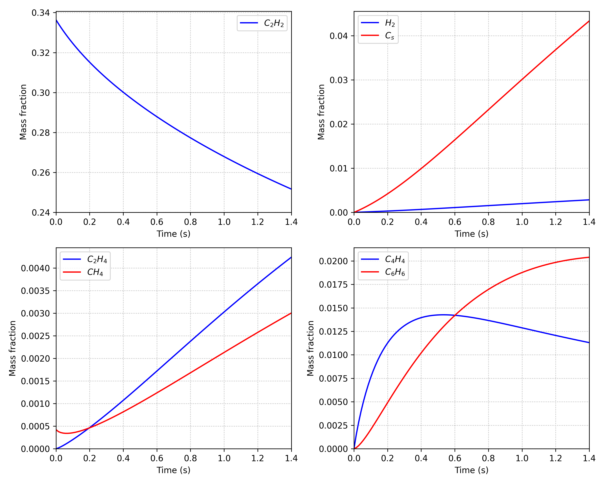
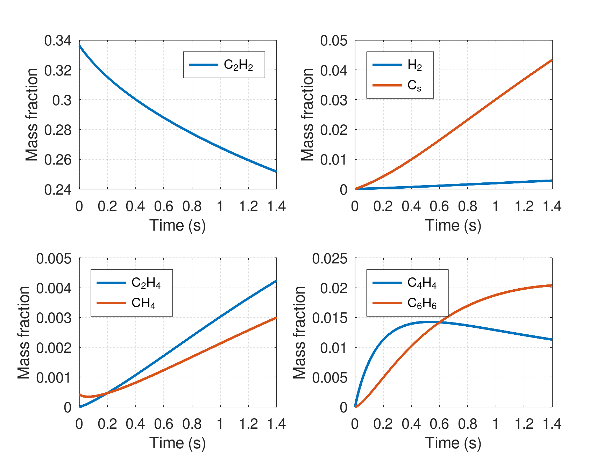

# Graf's global kinetics


In this study we will perform the integration of a simplified chemical mechanism of acetylene pyrolysis as provided in this [thesis](https://publikationen.bibliothek.kit.edu/1000007244/97488) by [@Graf2007]. This mechanism is composed by 7 chemical species and the reaction rate equations are given in the table below. Although such simplified mechanism does not hold the thermodynamics of the system (because equations are not expressed in mass action kinetics formalism), it proves useful for CFD computation of chemically reacting flows since it largely reduces the number of equations to solve - a detailed acetylene pyrolysis mechanism such as [@Norinaga2009] has more than 200 chemical species, requiring integration of each of them in the simulated system. Such a detailed simulation would require the solution of mass, momentum, energy, and species simulations. Just a conventional CFD simulation can already prove difficult in computational terms, adding up species makes the problem exponentially more complex. The temperature dependent rate coefficient in these equations is given by $k(t)=A\exp\left(-\frac{E_a}{RT}\right)$, where the units of $A$ are such that the rate expression is given in moles per second, and $Ea$ is provided in $kJ$.


<table>
  <tr>
    <th style="width: 200px;">Reaction</th>
    <th style="width: 100px;">$A$</th>
    <th style="width: 100px;">$E_a$</th>
    <th style="width: 300px;">Rate</th>
  </tr>
  <tr>
    <td>$C_2H_2 + H_2 \rightarrow C_2H_4$</td>
    <td style="text-align: center;">4.4e+03</td>
    <td style="text-align: center;">1.0300e+05</td>
    <td>$r_{1}=k_{1}(T)[C_2H_2][H_2]^{0.36}$</td>
  </tr>
  <tr>
    <td>$C_2H_4 \rightarrow C_2H_2 + H_2$</td>
    <td style="text-align: center;">3.8e+07</td>
    <td style="text-align: center;">2.0000e+05</td>
    <td>$r_{2}=k_{2}(T)[C_2H_4]^{0.50}$</td>
  </tr>
  <tr>
    <td>$C_2H_2 + 3 H_2 \rightarrow 2 CH_4$</td>
    <td style="text-align: center;">1.4e+05</td>
    <td style="text-align: center;">1.5000e+05</td>
    <td>$r_{3}=k_{3}(T)[C_2H_2]^{0.35}[H_2]^{0.22}$</td>
  </tr>
  <tr>
    <td>$CH_4 + CH_4 \rightarrow C_2H_2 + 3 H_2$</td>
    <td style="text-align: center;">8.6e+06</td>
    <td style="text-align: center;">1.9500e+05</td>
    <td>$r_{4}=k_{4}(T)[CH_4]^{0.21}$</td>
  </tr>
  <tr>
    <td>$C_2H_2 + C_2H_2 \rightarrow C_4H_4$</td>
    <td style="text-align: center;">1.2e+05</td>
    <td style="text-align: center;">1.2070e+05</td>
    <td>$r_{6}=k_{6}(T)[C_2H_2]^{1.60}$</td>
  </tr>
  <tr>
    <td>$C_4H_4 \rightarrow C_2H_2 + C_2H_2$</td>
    <td style="text-align: center;">1.0e+15</td>
    <td style="text-align: center;">3.3520e+05</td>
    <td>$r_{7}=k_{7}(T)[C_4H_4]^{0.75}$</td>
  </tr>
  <tr>
    <td>$C_4H_4 + C_2H_2 \rightarrow C_6H_6$</td>
    <td style="text-align: center;">1.8e+03</td>
    <td style="text-align: center;">6.4500e+04</td>
    <td>$r_{8}=k_{8}(T)[C_2H_2]^{1.30}[C_4H_4]^{0.60}$</td>
  </tr>
  <tr>
    <td>$C_2H_2 \rightarrow 2 C(s) + H_2$</td>
    <td style="text-align: center;">5.5e+06</td>
    <td style="text-align: center;">1.6500e+05</td>
    <td>$r_{5}=k_{5}(T)\dfrac{[C_2H_2]^{1.90}}{1+18[H_2]}$</td>
  </tr>
  <tr>
    <td>$C_6H_6 \rightarrow 6 C(s) + 3 H_2$</td>
    <td style="text-align: center;">1.0e+03</td>
    <td style="text-align: center;">7.5000e+04</td>
    <td>$r_{9}=k_{9}(T)\dfrac{[C_6H_6]^{0.75}}{1+22[H_2]}$</td>
  </tr>
</table>


Generally, when dealing with chemical species, one writes the equations in terms of mass fractions. This is useful (and in many other applications) to easily evaluate mass balance. Rate equations are provided above are computed with concentrations, so if integrating mass fraction rates one must perform the conversion inside the rate expression, as provided below. The rate of generation/consumption of each species is given by the weighted sum of the rates of each equation where it appears multiplied by its stoichiometric coefficient in this reaction. For providing a general formulation, this is generally done with a matrix of stoichiometric coefficients often called $\nu$ (the Greek letter *nu*), where negative signs represent reacting species that are consumed and positive signs the generated products. Function `graf_kinetics` implements the species rates for this system as described above. Notice that for the porter gas $N_2$ that does not participate in reactions, we compute its rate as the balance of the other species, ensuring mass conservation in the system. You are invited to remove this balance and study the effect of integrating without it for different numerical tolerances: mass conservation, *i.e.* $\sum{}Y=1$, may diverge from unit depending on integration conditions.


## Cantera implementation

- [Chemically activated reactions](https://cantera.org/stable/reference/kinetics/rate-constants.html#chemically-activated-reactions)
- [Arbitrary reaction orders](https://cantera.org/stable/reference/kinetics/reaction-rates.html#reaction-orders)

```python
%matplotlib agg
from graf_simulation import GrafSimulation
import cantera as ct
```

```python
simulation = GrafSimulation(T = 1173.0, P = 5000.0, f = 0.36, verbose=False)
states = simulation.run(tout = 1.4, nsteps = 100)

fig, ax = simulation.plot()
fig.savefig("graf_plot_cantera.png", dpi=300)
```




## Octave implementation

To run the integrator from an Octave terminal active at this level, call/modify `graf_main`.


