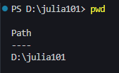
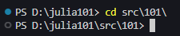
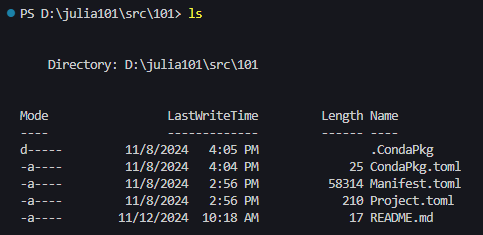
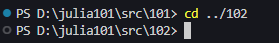

# Command line

## Basics

If this is you first time using the command prompt you might be interested by this section. The command prompt (often referred to as *terminal* in Linux world) is your interface to interact with the operating system and many available tools. To learn any useful scientific computing skills it is useful to get a grasp of its use because it is there that we will launch most applications. The illustrations below assume you are working under Windows, but the introductory commands are common to most operating systems. 

Now let's launch a terminal. If you are working under [VS Code](vscode.md) you can use the shortcut to display the terminal `Ctrl+J`; the bottom of your window should display something as

The start of this line displays you *path* in the system; depending on your configuration that could not be the case and you can ask the OS to give you that with `pwd` (print working directory)

If you are invited to move to directory `src` you may which to use command *change directory*, or `cd` in the system's language

Now that you reached your destination, you might be interested at inspecting the contents of this directory, *i.e.* listing its contents; that is done with `ls` as follows

Oops! It was not the directory you wanted to go to! No problems, you can navigate *one-level-upwards* using the special symbol `..` (two dots) and change directory again

This is the minimum you need to know: navigate, know your address, inspect contents.
