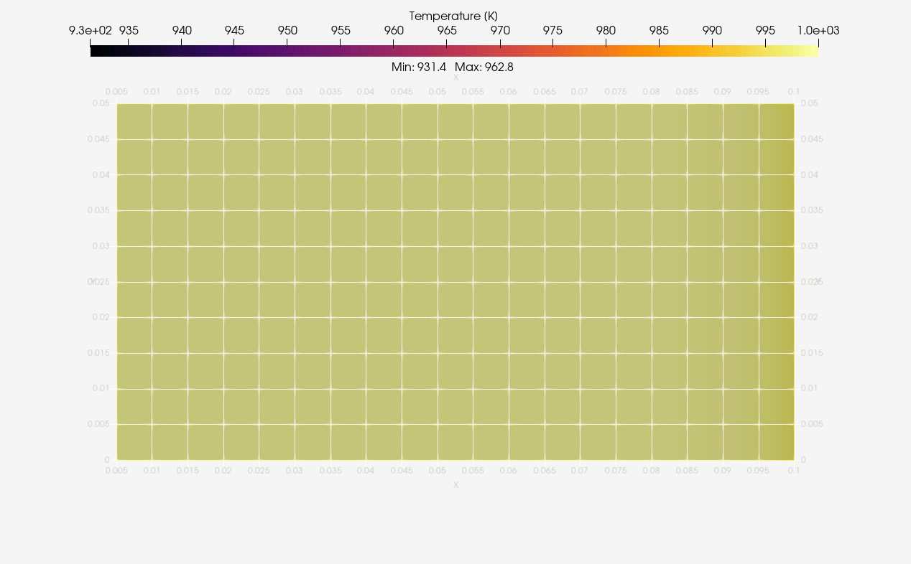
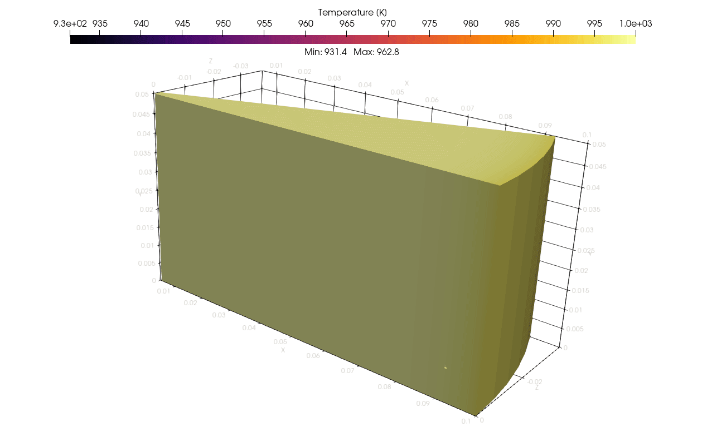

# Heat conduction in Elmer

The goals of this set of cases is to:

- illustrate how to setup heat conduction in Elmer;
- compare solutions of the same problem in 2D and 3D;
- help on how to interpret symmetries and fluxes in Elmer;
- provide uses of data extraction during calculation.

Before following the discussion below, the reader is invited to check the guided setup of a reference case under [concept](concept/README.md). This is provided to facilitate the structuring of SIF files. Once the initial SIF file is generated, you can copy it to the `2d` directory, where is continue the discussion.

## Conduction in 2D

The case you find here is essentially the same as the one under [concept](concept/README.md). A few editions to the SIF file were performed so that we get ready to reuse it in 3D and run reproducibly with script automation.

As the script is expected to be manually edited from now on, we added comments (in SIF a comment line starts with a `!` as in Fortran - the main language of Elmer) splitting the case in logical blocks with *general* content, *material and its domain*, the *solvers*, and finally the *conditions*.

The location of the mesh was changed from default (the only supported location when using the GUI) to a directory called `domain` (same name of the `gmsh` file) by adding the following line to the `Header` section:

```c
Mesh DB "domain" "."
```

If you followed the [concept](concept/README.md) setup you should already have a mesh here, otherwise run:

```shell
gmsh - domain.geo
```

This can be converted to Elmer format with `ElmerGrid` by running:

```shell
ElmerGrid 14 2 domain.msh -autoclean -merge 1.0e-05
```

In this command `14` represents the `gmsh` input format and `2` the `ElmerSolver` file format. For the other options, please check the [documentation](https://www.nic.funet.fi/pub/sci/physics/elmer/doc/ElmerGridManual.pdf).

For a standard sequential run simple enter:

```shell
ElmerSolver
```

It was not illustrated above, but it is important to redirect the output of these commands to log files so that they can be inspected for any errors or warnings. Results are dumped to `results/` directory as defined in the concept phase and can be inspected with [ParaView](../../../paraview/basics.md).

## Conduction in 3D

Adapting the case for running with a 3D geometry (provided under directory `3d`) is quite simple now. First, we modify the coordinate system under `Simulation` section to cartesian. This is because now we are solving an actual 3D geometry and enforcing specific coordinate systems is no longer required (or formally compatible).

```c
Coordinate System = Cartesian
```

For converting the `gmsh` file you can proceed the same way as in 2D. If is worth opening the generated `.msh` file with `ElmerGUI` to inspect the numbering of boundary conditions (it will be later required to be edited in SIF).  Because the sides (symmetry of cylinder) are not present in 2D (it is the plane itself), you need to add an extra boundary condition as follows:

```c
Boundary Condition 4
  Target Boundaries(1) = 4 
  Name = "Symmetry"
  Heat Flux = 0
End
```

To generate the `ElmerSolver` mesh under `domain/` we run the same command as before. Because transient 3D cases are quite computationally intensive, for any practical purposes the simulation must be run in parallel. Domain decomposition is also performed with `ElmerGrid` as follows:

```shell
ElmerGrid 2 2 domain -partdual -metiskway 16
```

In the above command the number `16` represents the number of cores; you might need to adapt for a lower value if running from most laptops (generally with 4 or 6 cores these days). For running in parallel with 16 cores we need to run the command:

```shell
mpiexec -n 16 ElmerSolver_mpi
```

The command `mpiexec` is how the message passing interface (MPI) runner is called in Windows; for Linux this should be `mpirun` instead.

## Post-processing

ParaView was employed to generate standard animations of temperature evolution in bodies. Below we have the 2D axisymetric results:



The same was done for 3D equivalent case as illustrated next:



*Ongoing*

- Comparison of temperature profile
- Interpretation and verification of flux

## Classification

#elmer/domain/axisymmetric
#elmer/domain/transient
#elmer/models/heat-equation 
#elmer/models/save-line
#elmer/models/flux-solver
